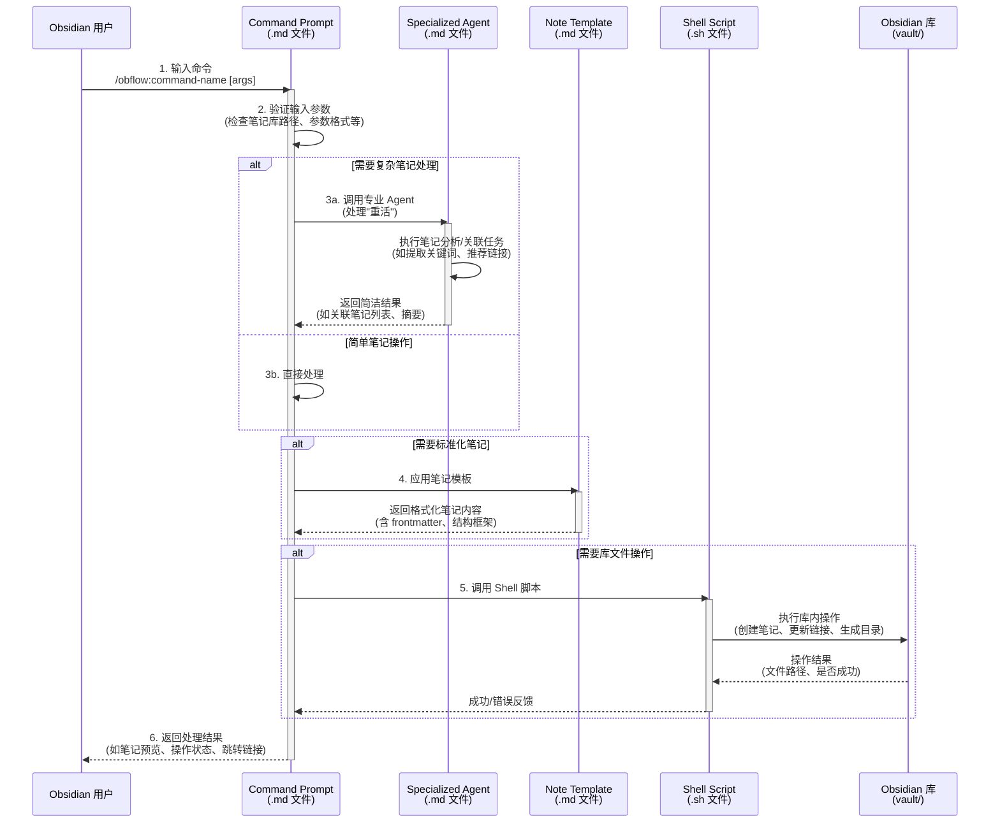

## Obflow 系统概述

Obflow 是一个 AI 驱动的笔记辅助工具包，为 Obsidian 用户提供虚拟笔记专家团队。它作为 iflow workflow, iflow CLI 运行在obsidian vault目录。

## 核心理念

Obflow 采用"AI 驱动的笔记专家组织"模型，包含三个核心角色：
1. **Obsidian 用户** - 笔记体系的构建者和决策者
2. **Obflow Core（核心代理）** - 虚拟笔记主管，通过引导式提问优化笔记逻辑
3. **子代理（领域专家）** - 10 个专业代理，如笔记整理、链接分析、模板生成、知识图谱优化等

## 系统架构

### 单一事实来源架构
所有组件维护在统一的 `core/` 目录中，安装时动态部署到 Obsidian 插件目录：

- `core/agents/obflow/` - 10 个 AI 代理定义（如笔记结构化代理、关联推荐代理等）
- `core/commands/obflow/` - 16 个命令实现
- `core/scripts/obflow/` - 自动化脚本（如批量处理笔记）
- `core/templates/` - 笔记模板（如读书卡、会议纪要、项目规划等）

### 5 部分命令模式
每个命令由最多 5 个部分组成：

1. 用户命令（`/obflow:command-name`）
2. 命令提示（`.md` 文件，指导代理行为）
3. 代理（可选，处理复杂笔记分析）
4. 模板（可选，结构化笔记内容）
5. 脚本（可选，笔记批量操作）

### 交互时序图

## 工作空间结构

Obsidian Vault（库）目录下自动生成 `obflow-workspace/` 存储所有辅助工件：

- `notes-optimized/` - 优化后的笔记版本
- `templates-generated/` - 自动生成的笔记模板
- `graph-analysis/` - 知识图谱分析报告
- `links-recommendations/` - 笔记关联推荐结果
- `sources-imported/` - 导入的外部资料（如网页、PDF 转换笔记）

## 核心功能

系统提供 16 个命令，涵盖完整的 Obsidian 笔记工作流：

- 笔记结构化（`/obflow:structure-note`）
- 关联链接推荐（`/obflow:recommend-links`）
- 模板生成（`/obflow:generate-template`）
- 知识图谱优化（`/obflow:optimize-graph`）
- 批量格式转换（`/obflow:batch-convert`）
- 内容摘要提取（`/obflow:extract-summary`）

## obsidian和iflow生态 （尽可能利用obsidian和iflow的生态）
- obsidian plugin：local REST api
- obsidian plugin：tasks
- obsidian plugin：excalidraw
- iflow MCPs，agents，commands
