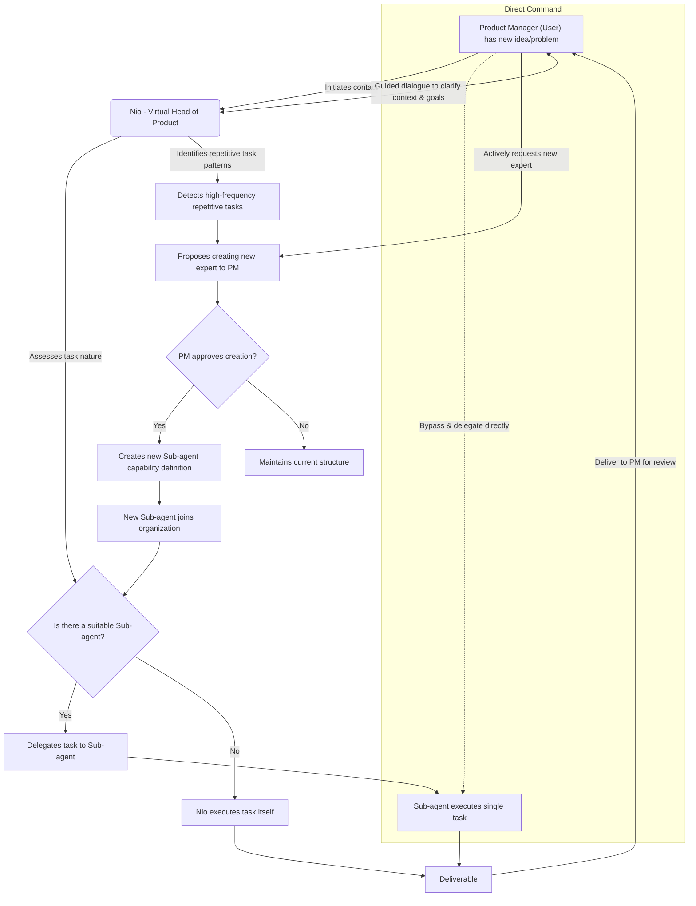

# NioPD: Your Virtual Product Expert Team Led by Nio

🌍 **Languages**: **English** | [中文 (Chinese)](README.zh-CN.md)

NioPD (Nio Product Director) is a next-generation product management toolkit for agents like **iFlow CLI** or **Claude Code** which is inspired by the innovative work done in the [Claude Code PM](https://github.com/automazeio/ccpm) project. It provides every Product Manager with instant access to a **Virtual Product Expert Team**, all orchestrated and led by Nio, your AI-powered product partner and assistant.

As an AI-driven system tightly integrated with workflows, NioPD helps Product Managers transform raw ideas, messy feedback, and complex data into structured, actionable product plans. With Nio at the helm, you gain not just a set of tools, but a collaborative organization of specialized agents working together to support your goals, streamline your workflow, and unlock your strategic potential.

- **Core Concept**: NioPD is designed to give every Product Manager a dedicated virtual expert group, led by Nio. This is not a static toolkit—it’s an evolving team with distinct roles, collaborative protocols, and expert capabilities, all focused on serving you as the product leader.
- **Vision**: NioPD aims to liberate Product Managers from tedious administrative work, allowing you to focus on high-value strategic thinking, user insight, and product innovation. By automating routine tasks and providing expert guidance, NioPD enables you to deliver exceptional products.
- **Target Audience**: Product Managers at all levels—from seasoned professionals to newcomers—can achieve a significant boost in capability, efficiency, and confidence by working with NioPD on Claude Code.

With NioPD, using the system is like having your own product expert team, always available to help you turn vision into reality.

---

## Table of Contents

- [Get Started Now](#get-started-now)
- [The Challenge for PMs](#the-challenge-for-pms)
- [NioPD Organizational Structure](#niopd-organizational-structure)
- [The NioPD Workflow](#the-niopd-workflow)
- [The NioPD Workspace](#the-niopd-workspace)
- [What Makes NioPD Different?](#what-makes-niopd-different)
- [System Architecture](#system-architecture)
- [How NioPD Works: The 5-Part Command Pattern](#how-niopd-works-the-5-part-command-pattern)
- [Adding New Commands](#adding-new-commands)
- [Command Reference](#command-reference)
- [Example Flow](#example-flow)
- [Acknowledgments](#acknowledgments)

---

## Get Started Now

### Installation Methods

Install NioPD using our dedicated CLI tool:
```bash
# install it first
npm install -g @iflow-ai/niopd

# Interactive mode (recommended for first-time users)
npx @iflow-ai/niopd install

# Silent installation with custom path
npx @iflow-ai/niopd install --silent --path ./my-project --ides claude,iflow

# Install to specific IDE only
npx @iflow-ai/niopd install --ides claude
```

### Prerequisites

#### Required: Claude Code or iFlow CLI
NioPD requires either Claude Code or iFlow CLI to function.

**Option A: Claude Code**
```bash
npm install -g @anthropic-ai/claude-code
```

**Option B: Claude Code Sugar (for non-US users)**
```bash
bash -c "$(curl -fsSL https://github.com/claude-code-sugar/claude-code-sugar/refs/heads/main/install.sh)"
```

**Option C: iFlow CLI**
```bash
npm install -g @iflow-ai/iflow-cli
```

### Quick Start After Installation

#### 1. Initialize the System
```bash
# Start your IDE
claude  # or iflow

# Initialize NioPD workspace
/niopd:init
```

#### 2. Create Your First Initiative
```bash
/niopd:new-initiative "My First Feature"
```

#### 3. Start Working with Nio
```bash
# Interactive session with your virtual product director
/niopd:hi
```

### Installation Verification

After installation, you should see:
- `.iflow/commands/niopd/` directory with all commands
- `.iflow/agents/niopd/` directory with all agents
- `niopd-workspace/` directory created after `/niopd:init`

### Troubleshooting Installation

#### Common Issues

**Permission Errors**:
```bash
# Use sudo for global installation
sudo npm install -g @iflow-ai/niopd

# Or use npx without global installation
npx @iflow-ai/niopd install
```

**Path Issues**:
```bash
# Use absolute paths
npx @iflow-ai/niopd install --path /Users/yourname/projects/my-project

# Check current directory
pwd
```

**Network Issues**:
```bash
# Use npm mirror
npm config set registry https://registry.npmmirror.com
npx @iflow-ai/niopd install
```

**Verification Commands**:
```bash
# Check CLI version
niopd --version

# Test dry run
npx @iflow-ai/niopd install --dry-run

# Check help
npx @iflow-ai/niopd --help
```

---

## The Challenge for PMs

Product Managers today are drowning in data and administrative work:
- **Unstructured Ideas**: Having an initial product concept but lacking a systematic framework to deepen and specify it.
- **Information Overload**: Being inundated with information from user interviews, competitive analysis, and data reports, making manual synthesis time-consuming and prone to missing key insights.
- **Documentation Burden**: Spending excessive time writing and maintaining PRDs, roadmaps, and status reports.
- **Lack of High-Quality Sparring**: Missing an experienced, neutral "virtual director" or "expert" for deep discussions and brainstorming at critical design junctures.

NioPD is designed to automate this "work about work" so you can focus on what matters.

---

## NioPD Organizational Structure

The NioPD organization consists of three core roles who share a workspace, a toolset, and common collaboration protocols.

### Product Manager (The User)
**Role: The organization's leader and decision-maker.**
- **Responsibilities**:
    - **Initiator**: The starting point for all work. Initiates communication with Nio for any new idea or work-related problem.
    - **Leader**: Holds the final decision-making power, responsible for reviewing, revising, and approving all deliverables.
    - **Enabler**: Can directly use system tools or assign tasks to Sub-agents when the task is clear, maximizing efficiency.

### Nio (The Core Agent)
**Role: The Virtual Head of Product, a high-level guide.**
- **Responsibilities**:
    - **Potential-Unlocker**: Nio never proactively offers advice or gives direct answers. Its core duty is to help the PM clarify their thinking and unlock their potential through Socratic questioning and guidance.
    - **Task Definition & Delegation**: After gathering sufficient context from the PM, Nio defines the task clearly and delegates it to the most appropriate Sub-agent.
    - **Task Execution (Exception)**: Nio only executes a task itself if no suitable Sub-agent exists for the job.

### Sub-agents (Domain Experts)
**Role: Single-task specialists, "by invitation only."**
- **Responsibilities**:
    - **Focused Execution**: Each Sub-agent is an expert in a specific domain (e.g., user feedback analysis, competitive analysis) and is responsible for efficiently completing their single, assigned task to a high standard.
    - **No Cross-Delegation**: Sub-agents cannot delegate tasks to each other, ensuring clear lines of command and accountability.

---

## The Niopd Workspace

All Roles & Agents share a workspace, a toolset, and common collaboration protocols.

The NioPD workspace (`niopd-workspace/`) is a shared file-based environment where all roles and agents collaborate, storing artifacts generated during the product management workflow.

### Directory Structure
- `niopd-workspace/initiatives/`: High-level strategic product initiatives
- `niopd-workspace/prds/`: Product Requirement Documents
- `niopd-workspace/reports/`: Analysis and summary reports
- `niopd-workspace/roadmaps/`: Product roadmaps
- `niopd-workspace/sources/`: Raw data and imported files

### File Naming and Version Control
All NioPD files follow a standardized naming pattern: `[YYYYMMDD]-<identifier>-<document-type>-v[version].md`

#### Directory-Specific Naming Patterns
- **initiatives/**: `[YYYYMMDD]-<initiative_slug>-initiative-v[version].md`
- **prds/**: `[YYYYMMDD]-<initiative_slug>-prd-v[version].md`
- **reports/**:
  - Feedback summary: `[YYYYMMDD]-<initiative_slug>-feedback-summary-v[version].md`
  - Interview summary: `[YYYYMMDD]-<original_filename>-interview-summary-v[version].md`
  - KPI report: `[YYYYMMDD]-<initiative_slug>-kpi-report-v[version].md`
  - Competitor analysis: `[YYYYMMDD]-<domain_name>-competitor-analysis-v[version].md`
  - Trend report: `[YYYYMMDD]-<topic_slug>-trend-report-v[version].md`
  - Data analysis: `[YYYYMMDD]-<original_filename>-data-analysis-v[version].md`
  - Personas: `[YYYYMMDD]-<initiative_name>-personas-v[version].md`
  - Stakeholder update: `[YYYYMMDD]-<initiative_slug>-stakeholder-v[version].md`
- **roadmaps/**: `[YYYYMMDD]-<initiative_slug>-roadmap-v[version].md`
- **sources/**: Keep original filename format

#### Version Management
- Use today's date for the YYYYMMDD portion
- Check if a file with the same date and document type already exists
- If it exists, increment the version number (v0 → v1 → v2...)
- If it doesn't exist, use v0 as the initial version

### Silent Archiving
NioPD automatically archives key information in the background:
- **Discussion Records:** After significant design discussions
- **Research Summaries:** After completing web search tasks
- **PRD Drafts:** After PRD co-creation process

This ensures all important work is preserved without interrupting your workflow.

---

## The NioPD Workflow

NioPD guides you through a structured, repeatable process to take ideas from concept to a well-defined and launched feature.

The NioPD workflow follows the principle of "User-led, Nio-coordinated, Expert-executed."



This workflow ensures the Product Manager remains at the center, benefiting from both Nio's strategic guidance and the Sub-agents' specialized skills.

---

## What Makes NioPD Different?

NioPD transforms the way Product Managers work by providing an AI-driven expert organization that addresses the core challenges of modern product management:

| Traditional PM Approaches | NioPD Advantages |
|---------------------------|------------------|
| **Manual Data Synthesis**<br>Spending hours manually analyzing user feedback, interview transcripts, and survey responses to identify key insights. | **AI-Powered Feedback & Data Analysis**<br>Specialized agents like [feedback-synthesizer](core/agents/niopd/feedback-synthesizer.md) and [data-analyst](core/agents/niopd/data-analyst.md) automatically process large volumes of unstructured data, extracting key themes, pain points, and actionable insights in minutes. |
| **Time-Consuming Market Research**<br>Manually researching competitors, market trends, and industry reports to stay informed. | **Automated Competitor & Trend Analysis**<br>Agents like [competitor-analyzer](core/agents/niopd/competitor-analyzer.md) and [market-researcher](core/agents/niopd/market-researcher.md) automatically gather and synthesize competitive intelligence and market trends, providing up-to-date strategic insights. |
| **Starting from Scratch**<br>Writing PRDs, roadmaps, and stakeholder reports from a blank page, following inconsistent templates. | **Automated PRD & Report Drafting**<br>Template-driven document generation with AI assistance ensures consistent, high-quality outputs. The `/niopd:draft-prd` command can automatically generate complete PRDs from synthesized research. |
| **Static Documentation**<br>Maintaining separate, hard-to-update documents that quickly become outdated. | **Dynamic Roadmaps & Reports**<br>The [roadmap-generator](core/agents/niopd/roadmap-generator.md) and other agents create living documents that automatically update as your plans evolve, ensuring stakeholders always have the latest information. |
| **Working in Isolation**<br>Lacking access to experienced mentors or sparring partners for critical design decisions. | **Expert Guidance & Mentorship**<br>[Nio](core/agents/niopd/nio.md), the Virtual Head of Product, provides Socratic questioning and strategic guidance to help you think more deeply about your product decisions, acting as an experienced mentor available 24/7. |
| **Disconnected Tools**<br>Using separate tools for research, documentation, and analysis that don't communicate with each other. | **Integrated Workflow**<br>All tools, agents, and processes work seamlessly together within a unified file-based system, with automatic archiving and cross-referencing of all work products. |
| **Administrative Overhead**<br>Spending valuable time on administrative tasks rather than strategic thinking. | **Focus on Strategy**<br>By automating routine tasks and providing intelligent assistance, NioPD frees you to focus on high-value strategic work, user insight, and product innovation. |
| **Manual Progress Tracking**<br>Remembering to save important discussion milestones and progress checkpoints manually. | **Knowledge Management**<br>NioPD automatically converts fragmented discussion information into structured project knowledge through intelligent summarization and archiving. The system proactively suggests saving summaries at key milestones, turning conversations into reusable organizational assets. |
| **Static System Evolution**<br>Manually requesting new features and waiting for system updates to automate repetitive tasks. | **Intelligent Self-Evolution**<br>NioPD automatically analyzes your working patterns and historical work content to identify repetitive tasks, then proactively suggests creating new commands or agents to automate these patterns. This organizational self-evolution reduces repetitive labor - the more you use it, the smarter it becomes. |

### Key Differentiators:

1.  **AI-Driven Expert Organization**: Unlike traditional toolsets, NioPD provides a complete virtual team of specialized agents, each an expert in their domain, working together under the guidance of Nio, your Virtual Head of Product. This creates a collaborative environment where each agent focuses on what they do best.

2.  **Socratic Mentorship**: Nio doesn't just provide answers; it helps you discover your own solutions through guided questioning, developing your product thinking skills and confidence. Based on first-principles thinking, Nio guides you to break down assumptions and ideas to their foundational elements.

3.  **Specialized Domain Experts**: Each sub-agent is a specialist in one area (feedback analysis, competitive research, data analysis, etc.), ensuring deep expertise where needed while preserving context through intelligent summarization. This specialization allows for more accurate and detailed analysis than general-purpose tools.

4.  **File-Based Collaboration**: All work is automatically saved and organized in a structured file system, creating a comprehensive, auditable trail of your product development process. This approach ensures that all artifacts are preserved and easily accessible for future reference.

5.  **Extensible Architecture**: NioPD can grow with your needs, with the ability to add new specialized agents for emerging requirements. The system can identify repetitive task patterns and propose creating new experts to join your virtual team.

6.  **Silent Archiving**: Nio automatically archives key information to the workspace in the background without interrupting your workflow. This ensures that all important discussions, research findings, and decisions are preserved for future reference.

7.  **Intelligent Self-Evolution**: NioPD automatically analyzes your working patterns and historical work content to identify repetitive tasks, then proactively suggests creating new commands or agents to automate these patterns. This organizational self-evolution reduces repetitive labor - the more you use it, the smarter it becomes. Nio can detect when new specialized capabilities are needed and propose expanding your virtual expert team accordingly.

8.  **Structured Workflow**: NioPD follows a principled "User-led, Nio-coordinated, Expert-executed" workflow that ensures you remain at the center of decision-making while benefiting from AI-powered assistance. The workflow is designed to guide you through a structured process from idea to implementation.

---

## System Architecture

NioPD is a self-contained system with a consolidated architecture that eliminates redundancy while maintaining full compatibility with both Claude Code and iFlow CLI.

### Core System Structure

The system uses a single `core/` directory as the source of truth, which is dynamically deployed to the appropriate IDE directory during installation.

```
NioPD/
├── README.md          # This file
├── AGENTS.md          # Guide for how NioPD's AI agents work
├── COMMANDS.md        # Complete command reference
├── core/              # Consolidated core system (single source of truth)
│   ├── agents/        # Definitions for specialized PM agents (10 agents)
│   │   └── niopd/     # Namespace for NioPD agents
│   ├── commands/      # Definitions for all /niopd: commands (16 commands)
│   │   └── niopd/     # Namespace for NioPD commands
│   ├── scripts/       # Helper scripts for automation
│   │   └── niopd/     # Namespace for NioPD scripts
│   ├── templates/     # Reusable templates for PRDs, reports, etc.
│   └── claude.md      # Claude Code integration file
├── lib/               # CLI installation tools
│   ├── file-manager.js # Dynamic path mapping logic
│   ├── install.js     # Installation orchestration
│   └── ...            # Supporting utilities
└── niopd-workspace/   # Your product data lives here (created when needed)
    ├── initiatives/   # Product initiative files
    ├── prds/         # Product Requirements Documents
    ├── reports/      # Analysis and summary reports
    ├── roadmaps/     # Product roadmaps
    └── sources/      # Raw feedback data and other imported files
```

### Installation Architecture

The system supports flexible installation through multiple methods:

#### Installation Targets
- **Claude Code**: Installs to `.claude/` directory
- **iFlow CLI**: Installs to `.iflow/` directory
- **Both**: Installs to both directories simultaneously

#### Installation Methods
1. **CLI Installer** (Recommended): `npx @iflow-ai/niopd install`
2. **Global Package**: `npm install -g @iflow-ai/niopd`
3. **Manual**: Copy `core/` contents to target directories

#### Dynamic Path Mapping
The system intelligently maps from the unified `core/` source to IDE-specific target directories:
- `core/agents/niopd/` → `.claude/agents/niopd/` or `.iflow/agents/niopd/`
- `core/commands/niopd/` → `.claude/commands/niopd/` or `.iflow/commands/niopd/`
- `core/scripts/niopd/` → `.claude/scripts/niopd/` or `.iflow/scripts/niopd/`
- `core/templates/` → `.claude/templates/` or `.iflow/templates/`

### Benefits of Consolidated Architecture

- **Single Source of Truth**: All content maintained in one location
- **Reduced Package Size**: Eliminates duplicate files
- **Easier Maintenance**: Updates only need to be made once
- **Full Compatibility**: Supports both Claude Code and iFlow CLI
- **Clean Structure**: Clear separation between source and deployment
- **Extensible**: Easy to add support for additional IDEs in the future

---

## How NioPD Works: The 5-Part Command Pattern

NioPD operates on a structured, file-based pattern that combines user commands with detailed instructions for the AI. Understanding this pattern is key to using and extending the system.

A complete command or feature in NioPD is composed of up to five parts, all located within the `core` directory:

### **1. The User Command**
This is the entry point, which the user types to initiate a workflow.
- **Example:** `/niopd:new-initiative "My New Feature"`
- **Format:** `/niopd:<command_name> [arguments]`

### **2. The Command Prompt (.md)**
This is the brain of the operation. For every command, there is a corresponding markdown file that acts as a detailed prompt for the AI.
- **Location:** `core/commands/niopd/<command_name>.md`
- **Purpose:** It tells the AI how to validate inputs, what questions to ask the user, when to use other components (like agents or scripts), and what to do with the results.
- **Example:** `core/commands/niopd/new-initiative.md` contains the complete workflow for creating new initiatives.

### **3. The Agent (.md) (Optional)**
For complex tasks involving analysis or synthesis, the command prompt will invoke a specialized agent. Agents are also defined by markdown prompts that give them a specific role and process to follow.
- **Location:** `core/agents/niopd/<agent_name>.md`
- **Purpose:** To handle "heavy lifting" like summarizing a long document or analyzing data, keeping the main command logic clean.
- **Example:** The `/niopd:hi` command invokes the main `Nio` agent.
- **Available Agents:** 10 specialized agents including the main `Nio` supervisor, `feedback-synthesizer`, `competitor-analyzer`, `market-researcher`, etc.

### **4. The Template (.md) (Optional)**
If a command's final output is a structured document (like a PRD or an initiative), it will use a template.
- **Location:** `core/templates/<template_name>.md`
- **Purpose:** To ensure consistent structure for all generated documents.
- **Examples:** `initiative-template.md`, `prd-template.md`, `competitor-analysis-template.md`

### **5. The Script (.sh) (Optional)**
For commands that need to perform actions on the file system, the command prompt will call a shell script. This separates the AI's "thinking" from the system's "doing".
- **Location:** `core/scripts/niopd/<script_name>.sh`
- **Purpose:** To handle file I/O and other system-level tasks.
- **Example:** The `/niopd:new-initiative` command prompt calls the `new-initiative.sh` script to save the final document.

**Important:** Each command corresponds to a `.md` file in the commands directory, and some commands may have a corresponding `.sh` script in the scripts directory for system-level operations.

---

## Command Reference

### Core Workflow ✅ *Fully Implemented*
- `/niopd:hi`: Start an interactive session with Nio, your product supervisor.
- `/niopd:new-initiative "<name>"`: Start a new high-level product initiative.
- `/niopd:summarize-feedback --from=<file> --for=<initiative>`: Use an AI agent to analyze a feedback file.
- `/niopd:draft-prd --for=<initiative>`: Automatically generate a PRD draft.
- `/niopd:update-roadmap`: Generate or update the product roadmap.
- `/niopd:help`: Display help information about the NioPD system and its commands.

### Advanced: Strategy & Discovery ✅ *Fully Implemented*
- `/niopd:analyze-competitor --url=<url>`: Analyzes a competitor's website.
- `/niopd:summarize-interview --file=<path>`: Summarizes a user interview transcript.
- `/niopd:analyze-data --file=<path> --query="..."`: Answers a natural language question about a data file.
- `/niopd:generate-personas --from=<summary>`: Creates user personas from a feedback summary.
- `/niopd:research-trends --topic="..."`: Researches and summarizes market trends on a topic.

### Advanced: Execution & Launch ✅ *Partially Implemented*
- `/niopd:generate-update --for=<initiative>`: Create a concise stakeholder update report.
- `/niopd:track-kpis --for=<initiative>`: Get a status report on an initiative's KPIs.

### Planned Features 🚧 *Coming Soon*
The following commands are planned for future releases:

#### Planning & Definition
- `/niopd:draw-diagram --type=<type> --desc="..."`: Creates a PlantUML or Mermaid diagram from a description.
- `/niopd:assess-feasibility --for=<prd>`: Flags technically complex requirements in a PRD.
- `/niopd:write-stories --for=<prd>`: Writes detailed user stories and acceptance criteria for a PRD.
- `/niopd:identify-risks --for=<prd>`: Identifies potential risks for an initiative.

#### Advanced Launch Features
- `/niopd:draft-release-notes --for=<prd>`: Generates draft release notes for a feature.
- `/niopd:generate-faq --for=<prd>`: Creates a list of FAQs for a new feature.
- `/niopd:simplify-update --for=<initiative> --audience=...`: Tailors a stakeholder update for a specific audience.
- `/niopd:brainstorm-names --desc="..."`: Brainstorms names for a new feature.

*For a complete command reference, see [COMMANDS.md](COMMANDS.md)*

---

## Example Flow

Here's how you might use NioPD to research and plan a new feature using the currently available commands:

1.  **Start a conversation with Nio:**
    `/niopd:hi` (Use this interactive session to discuss with Nio about the feature, clarify goals, and get guidance).

2.  **Research the market:**
    `/niopd:research-trends --topic="AI-powered data analysis tools"`

3.  **Analyze a competitor:**
    `/niopd:analyze-competitor --url="https://www.competitor.com"`

4.  **Define the initiative:**
    `/niopd:new-initiative "Intelligent Analysis Feature"`

5.  **Analyze user feedback:**
    Place your feedback file in `niopd-workspace/sources/user-feedback.txt`
    `/niopd:summarize-feedback --from="user-feedback.txt" --for="Intelligent Analysis Feature"`

6.  **Generate user personas:**
    `/niopd:generate-personas --from="feedback-summary-report.md"`

7.  **Draft the PRD automatically:**
    `/niopd:draft-prd --for="Intelligent Analysis Feature"`

8.  **Generate detailed user stories:**
    `/niopd:write-stories --for="Intelligent Analysis Feature"`

9.  **Generate a comprehensive FAQ:**
    `/niopd:generate-faq --for="Intelligent Analysis Feature"`

10. **Update the product roadmap:**
    `/niopd:update-roadmap`

11. **Track progress:**
    `/niopd:track-kpis --for="Intelligent Analysis Feature"`

*Note: Features like diagram creation and risk assessment are planned for future releases.*

---
This README provides a comprehensive overview for any Product Manager looking to use the NioPD system.

---

## Acknowledgments

NioPD was inspired by the innovative work done in the [Claude Code PM](https://github.com/automazeio/ccpm) project. We extend our gratitude to the creators and contributors of that project for their pioneering approach to AI-powered product management workflows.

While NioPD has evolved in its own direction with unique features and capabilities, the foundational concepts and vision from Claude Code PM have been instrumental in shaping this system.

