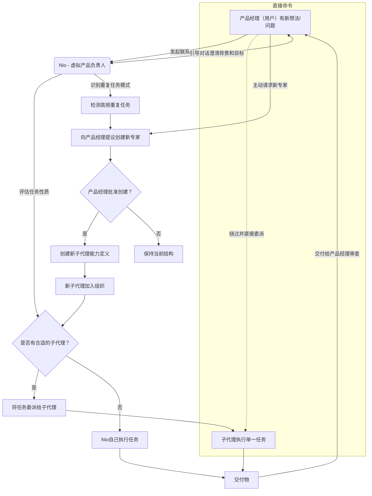

# NioPD: 由Nio领导的虚拟产品专家团队

🌍 **语言**: [English](README.md) | **中文 (Chinese)**

NioPD（Nio产品总监）是在[Claude Code PM](https://github.com/automazeio/ccpm)启发之下，专为**iFlow CLI**或**Claude Code**等代理设计的下一代产品管理工具包。它为每位产品经理提供即时访问**虚拟产品专家团队**的能力，全部由Nio——您的AI驱动产品合作伙伴和助手——协调和领导。

作为一个与工作流程紧密集成的AI驱动系统，NioPD帮助产品经理将原始想法、混乱的反馈和复杂数据转化为结构化、可操作的产品计划。有了Nio的领导，您不仅获得一套工具，更获得一个协作组织，由具有不同角色的专业代理组成，共同支持您的目标、简化您的工作流程，并释放您的战略潜力。

- **核心概念**：NioPD旨在为每位产品经理提供一个专门的虚拟专家组，由Nio领导。这不是一个静态的工具包——而是一个不断发展的团队，具有不同的角色、协作协议和专业能力，专注于为您这位产品领导者服务。
- **愿景**：NioPD旨在将产品经理从繁琐的行政工作中解放出来，让您专注于高价值的战略思考、用户洞察和产品创新。通过自动化日常任务和提供专业指导，NioPD使您能够交付卓越的产品。
- **目标受众**：各级产品经理——从经验丰富的专业人士到新手——都可以通过使用Claude Code上的NioPD获得能力、效率和信心的显著提升。

使用NioPD，就像拥有自己的产品专家团队，随时帮助您将愿景变为现实。

---

## 目录

- [立即开始](#立即开始)
- [产品经理面临的挑战](#产品经理面临的挑战)
- [NioPD组织结构](#niopd组织结构)
- [NioPD工作流程](#niopd工作流程)
- [NioPD工作空间](#niopd工作空间)
- [NioPD的独特之处](#niopd的独特之处)
- [系统架构](#系统架构)
- [NioPD如何工作：5部分命令模式](#niopd如何工作5部分命令模式)
- [添加新命令](#添加新命令)
- [命令参考](#命令参考)
- [示例流程](#示例流程)
- [致谢](#致谢)

---

## 立即开始

### 安装方法

使用我们的专用CLI工具安装NioPD：
```bash
# install it first
npm install -g @iflow-ai/niopd

# 交互模式（首次用户推荐）
npx @iflow-ai/niopd install

# 静默安装，自定义路径
npx @iflow-ai/niopd install --silent --path ./my-project --ides claude,iflow

# 仅安装到特定IDE
npx @iflow-ai/niopd install --ides claude
```

### 先决条件

#### 必需：Claude Code或iFlow CLI
NioPD需要Claude Code或iFlow CLI才能运行。

**选项A：Claude Code**
```bash
npm install -g @anthropic-ai/claude-code
```

**选项B：Claude Code Sugar（非美国用户）**
```bash
bash -c "$(curl -fsSL https://github.com/claude-code-sugar/claude-code-sugar/refs/heads/main/install.sh)"
```

**选项C：iFlow CLI**
```bash
npm install -g @iflow-ai/iflow-cli
```

### 安装后的快速开始

#### 1. 初始化系统
```bash
# 启动您的IDE
claude  # 或 iflow

# 初始化NioPD工作空间
/niopd:init
```

#### 2. 创建您的第一个计划
```bash
/niopd:new-initiative "我的第一个功能"
```

#### 3. 开始与Nio合作
```bash
# 与您的虚拟产品总监进行交互会话
/niopd:hi
```

### 安装验证

安装后，您应该看到：
- `.iflow/commands/niopd/`目录包含所有命令
- `.iflow/agents/niopd/`目录包含所有代理
- 执行`/niopd:init`后创建`niopd-workspace/`目录

### 安装故障排除

#### 常见问题

**权限错误**：
```bash
# 使用sudo进行全局安装
sudo npm install -g @iflow-ai/niopd

# 或使用npx无需全局安装
npx @iflow-ai/niopd install
```

**路径问题**：
```bash
# 使用绝对路径
npx @iflow-ai/niopd install --path /Users/yourname/projects/my-project

# 检查当前目录
pwd
```

**网络问题**：
```bash
# 使用npm镜像
npm config set registry https://registry.npmmirror.com
npx @iflow-ai/niopd install
```

**验证命令**：
```bash
# 检查CLI版本
niopd --version

# 测试试运行
npx @iflow-ai/niopd install --dry-run

# 检查帮助
npx @iflow-ai/niopd --help
```

---

## 产品经理面临的挑战

当今的产品经理正淹没在数据和行政工作中：
- **非结构化想法**：拥有初始产品概念，但缺乏系统化框架来深化和具体化它。
- **信息过载**：被用户访谈、竞争分析和数据报告中的信息淹没，手动综合耗时且容易遗漏关键洞察。
- **文档负担**：花费过多时间编写和维护PRD、路线图和状态报告。
- **缺乏高质量陪练**：在关键设计节点缺少经验丰富、中立的"虚拟总监"或"专家"进行深入讨论和头脑风暴。

NioPD旨在自动化这种"关于工作的工作"，让您专注于重要的事情。

---

## NioPD组织结构

NioPD组织由三个核心角色组成，他们共享工作空间、工具集和共同协作协议。

### 产品经理（用户）
**角色：组织的领导者和决策者。**
- **职责**：
    - **发起者**：所有工作的起点。就任何新想法或工作相关问题发起与Nio的沟通。
    - **领导者**：拥有最终决策权，负责审查、修订和批准所有交付物。
    - **赋能者**：可以直接使用系统工具或在任务明确时分配给子代理，最大化效率。

### Nio（核心代理）
**角色：虚拟产品负责人，高级指导者。**
- **职责**：
    - **潜力解锁者**：Nio从不主动提供建议或直接给出答案。其核心职责是通过苏格拉底式提问和指导帮助产品经理澄清思路并释放潜力。
    - **任务定义与委派**：从产品经理那里收集足够的背景信息后，Nio明确定义任务并将其委派给最合适的子代理。
    - **任务执行（例外）**：只有在没有合适的子代理时才由Nio自己执行任务。

### 子代理（领域专家）
**角色：单任务专家，"仅限邀请"。**
- **职责**：
    - **专注执行**：每个子代理都是特定领域的专家（例如，用户反馈分析、竞争分析），负责高效完成其单一分配任务并达到高标准。
    - **无交叉委派**：子代理不能相互委派任务，确保清晰的指挥线和问责制。

---

## NioPD工作流程

NioPD引导您完成一个结构化、可重复的过程，将想法从概念转化为定义明确且已启动的功能。

NioPD工作流程遵循"用户主导、Nio协调、专家执行"的原则。



此工作流程确保产品经理始终处于中心位置，同时受益于AI驱动的协助。

---

## NioPD工作空间

所有角色和代理共享工作空间、工具集和共同协作协议。

### NioPD工作空间定义
- **目的**：数据目录（`niopd-workspace/`）存储产品管理工作流程中生成的工件，以及用户提供的项目背景信息和原始数据。
- **实现**：
  - `niopd-workspace/initiatives/`：包含高级战略产品计划、头脑风暴信息以及手动添加的项目背景信息。
  - `niopd-workspace/prds/`：存储产品需求文档。
  - `niopd-workspace/reports/`：包含生成的报告和分析，如反馈分析。
  - `niopd-workspace/roadmaps/`：存储路线图文档。
  - `niopd-workspace/sources/`：存储用户手动导入用于分析的原始数据和其他数据资源文件。
- **最佳实践**：
  - 目录结构应该直观且文档完善
  - 文件应按类型和目的组织
  - 应使用一致的命名约定

### 文件存储目录规则

创建新命令或生成文件的新子代理时，请遵循以下目录结构规则：

- **计划**：将计划文件存储在`niopd-workspace/initiatives/`（例如，`niopd-workspace/initiatives/my-feature.md`）
- **PRD**：将产品需求文档存储在`niopd-workspace/prds/`（例如，`niopd-workspace/prds/prd-my-feature.md`）
- **报告**：将分析和总结报告存储在`niopd-workspace/reports/`（例如，`niopd-workspace/reports/competitor-analysis-my-feature.md`）
- **路线图**：将产品路线图存储在`niopd-workspace/roadmaps/`（例如，`niopd-workspace/roadmaps/product-roadmap.md`）
- **源数据**：将原始数据文件存储在`niopd-workspace/sources/`（例如，`niopd-workspace/sources/user-feedback.txt`）

所有文件创建操作应由位于`core/scripts/niopd/`中的相应shell脚本处理。每个脚本应该：
1. 验证输入参数
2. 根据内容类型构建适当的文件路径
3. 使用提供的内容创建文件
4. 验证文件是否成功创建
5. 提供清晰的成功/错误反馈

### 文件命名和归档协议

您必须在后台执行这些操作，而无需向用户明确详细说明每个命令。只需声明您正在"记录对话"或"归档研究"。

1. **确保目录存在**：保存前，运行`Bash(mkdir -p niopd-workspace/prds niopd-workspace/initiatives niopd-workspace/sources)`以确保目标目录可用。
2. **保存讨论记录**：
   - **何时**：在初始问题框架或重要设计讨论之后。
   - **命令**：`Bash(echo "..." > niopd-workspace/initiatives/discussion-summary-$(date +%s).md)`
   - **内容**：对话的markdown格式摘要。
3. **保存研究摘要**：
   - **何时**：完成网络搜索任务后。
   - **命令**：`Bash(echo "..." > niopd-workspace/sources/research-summary-$(date +%s).md)`
   - **内容**：网络发现的摘要，包含来源链接。
4. **保存PRD草稿**：
   - **何时**：完成PRD共同创建过程后。
   - **命令**：`Bash(echo "..." > niopd-workspace/prds/prd-draft-$(date +%s).md)`
   - **内容**：完整、格式化的PRD。

---

## NioPD的独特之处

NioPD通过提供AI驱动的专家组来改变产品经理的工作方式，解决现代产品管理的核心挑战：

| 传统PM方法 | NioPD优势 |
|---------------------------|------------------|
| **手动数据综合**<br>花费数小时手动分析用户反馈、访谈记录和调查回复以识别关键洞察。 | **AI驱动的反馈和数据分析**<br>像[feedback-synthesizer](core/agents/niopd/feedback-synthesizer.md)和[data-analyst](core/agents/niopd/data-analyst.md)这样的专业代理自动处理大量非结构化数据，在几分钟内提取关键主题、痛点和可操作洞察。 |
| **耗时的市场研究**<br>手动研究竞争对手、市场趋势和行业报告以保持信息更新。 | **自动竞争和趋势分析**<br>像[competitor-analyzer](core/agents/niopd/competitor-analyzer.md)和[market-researcher](core/agents/niopd/market-researcher.md)这样的代理自动收集和综合竞争情报和市场趋势，提供最新的战略洞察。 |
| **从零开始**<br>从空白页面编写PRD、路线图和利益相关者报告，使用不一致的模板。 | **自动PRD和报告起草**<br>模板驱动的文档生成与AI辅助确保一致、高质量的输出。`/niopd:draft-prd`命令可以从综合研究中自动生成完整的PRD。 |
| **静态文档**<br>维护单独的、难以更新的文档，这些文档很快过时。 | **动态路线图和报告**<br>[roadmap-generator](core/agents/niopd/roadmap-generator.md)和其他代理创建随着计划发展自动更新的活文档，确保利益相关者始终拥有最新信息。 |
| **孤立工作**<br>缺乏经验丰富的导师或陪练伙伴来讨论关键设计决策。 | **专家指导和辅导**<br>[Nio](core/agents/niopd/nio.md)，虚拟产品负责人，通过苏格拉底式提问和战略指导帮助您更深入地思考产品决策，充当24/7可用的经验丰富的导师。 |
| **断开的工具**<br>使用单独的研究、文档和分析工具，这些工具彼此不通信。 | **集成工作流程**<br>所有工具、代理和流程在统一的基于文件的系统中无缝协作，具有自动归档和所有工作产品的交叉引用。 |
| **行政开销**<br>将宝贵时间花在行政任务而非战略思考上。 | **专注于战略**<br>通过自动化日常任务和提供智能协助，NioPD让您专注于高价值的战略工作、用户洞察和产品创新。 |
| **手动进度跟踪**<br>记住手动保存重要讨论里程碑和进度检查点。 | **知识管理**<br>NioPD通过智能摘要和归档自动将碎片化的讨论信息转化为结构化的项目知识。系统主动建议在关键里程碑保存摘要，将对话转化为可重用的组织资产。 |
| **静态系统演进**<br>手动请求新功能并等待系统更新以自动化重复任务。 | **智能自我演进**<br>NioPD自动分析您的工作模式和历史工作内容，识别重复任务，然后主动建议创建新命令或代理来自动化这些模式。这种组织自我演进减少了重复劳动——您使用得越多，它变得越智能。 |

### 关键差异化因素：

1. **AI驱动的专家组**：与传统工具包不同，NioPD提供了一个完整的虚拟专业代理团队，每个代理都是其领域的专家，在Nio（您的虚拟产品负责人）的指导下协同工作。这创造了一个协作环境，每个代理都专注于他们最擅长的事情。

2. **苏格拉底式辅导**：Nio不仅提供答案；它通过引导式提问帮助您发现自己的解决方案，培养您的产品思维技能和信心。基于第一性原理思维，Nio引导您将假设和想法分解为其基本要素。

3. **专业领域专家**：每个子代理都是一个领域的专家（反馈分析、竞争研究、数据分析等），确保在需要时提供深度专业知识，同时通过智能摘要保持上下文。这种专业化允许比通用工具更准确和详细的分析。

4. **基于文件的协作**：所有工作都自动保存在结构化的文件系统中，创建产品开发过程的全面、可审计轨迹。这种方法确保所有工件都被保留并易于将来参考。

5. **可扩展架构**：NioPD可以随着您的需求而增长，能够添加新的专业代理以满足新兴需求。系统可以识别重复的任务模式并提议创建新的专家加入您的虚拟团队。

6. **静默归档**：Nio自动在后台将关键信息归档到工作空间，而不会中断您的工作流程。这确保所有重要讨论、研究发现和决策都被保留以供将来参考。

7. **智能自我演进**：NioPD自动分析您的工作模式和历史工作内容，识别重复任务，然后主动建议创建新命令或代理来自动化这些模式。这种组织自我演进减少了重复劳动——您使用得越多，它变得越智能。Nio可以检测何时需要新的专业能力，并提议相应地扩展您的虚拟专家组。

8. **结构化工作流程**：NioPD遵循"用户主导、Nio协调、专家执行"的原则工作流程，确保您始终处于决策中心，同时受益于AI驱动的协助。工作流程旨在引导您完成从想法到实施的结构化过程。

---

## 系统架构

NioPD是一个自包含系统，具有统一的架构，消除了冗余，同时保持与Claude Code和iFlow CLI的完全兼容性。

### 核心系统结构

系统使用单个`core/`目录作为事实来源，在安装期间动态部署到适当的IDE目录。

```
NioPD/
├── README.md          # 此文件
├── AGENTS.md          # NioPD的AI代理如何工作的指南
├── COMMANDS.md        # 完整命令参考
├── core/              # 统一核心系统（单一事实来源）
│   ├── agents/        # 专业PM代理的定义（10个代理）
│   │   └── niopd/     # NioPD代理的命名空间
│   ├── commands/      # 所有/niopd:命令的定义（16个命令）
│   │   └── niopd/     # NioPD命令的命名空间
│   ├── scripts/       # 自动化的辅助脚本
│   │   └── niopd/     # NioPD脚本的命名空间
│   ├── templates/     # PRD、报告等的可重用模板
│   └── claude.md      # Claude Code集成文件
├── lib/               # CLI安装工具
│   ├── file-manager.js # 动态路径映射逻辑
│   ├── install.js     # 安装编排
│   └── ...            # 支持实用程序
└── niopd-workspace/   # 您的产品数据存储在这里（需要时创建）
    ├── initiatives/   # 产品计划文件
    ├── prds/         # 产品需求文档
    ├── reports/      # 分析和总结报告
    ├── roadmaps/     # 产品路线图
    └── sources/      # 原始反馈数据和其他导入文件
```

### 安装架构

系统支持通过多种方法进行灵活安装：

#### 安装目标
- **Claude Code**：安装到`.claude/`目录
- **iFlow CLI**：安装到`.iflow/`目录
- **两者**：同时安装到两个目录

#### 安装方法
1. **CLI安装程序**（推荐）：`npx @iflow-ai/niopd install`
2. **全局包**：`npm install -g @iflow-ai/niopd`
3. **手动**：将`core/`内容复制到目标目录

#### 动态路径映射
系统智能地从统一的`core/`源映射到IDE特定的目标目录：
- `core/agents/niopd/` → `.claude/agents/niopd/`或`.iflow/agents/niopd/`
- `core/commands/niopd/` → `.claude/commands/niopd/`或`.iflow/commands/niopd/`
- `core/scripts/niopd/` → `.claude/scripts/niopd/`或`.iflow/scripts/niopd/`
- `core/templates/` → `.claude/templates/`或`.iflow/templates/`

### 统一架构的好处

- **单一事实来源**：所有内容都维护在一个位置
- **减少包大小**：消除重复文件
- **更易于维护**：更新只需进行一次
- **完全兼容**：支持Claude Code和iFlow CLI
- **干净结构**：源和部署之间的清晰分离
- **可扩展**：将来易于添加对额外IDE的支持

---

## NioPD如何工作：5部分命令模式

NioPD在结构化、基于文件的模式上运行，该模式将用户命令与AI的详细指令相结合。理解此模式是使用和扩展系统的关键。

NioPD中的完整命令或功能由最多五个部分组成，全部位于`core`目录中：

### **1. 用户命令**
这是入口点，用户输入以启动工作流程。
- **示例**：`/niopd:new-initiative "我的新功能"`
- **格式**：`/niopd:<command_name> [arguments]`

### **2. 命令提示（.md）**
这是操作的大脑。对于每个命令，都有一个相应的markdown文件作为AI的详细提示。
- **位置**：`core/commands/niopd/<command_name>.md`
- **目的**：它告诉AI如何验证输入、向用户询问什么问题、何时使用其他组件（如代理或脚本）以及如何处理结果。
- **示例**：`core/commands/niopd/new-initiative.md`包含创建新计划的完整工作流程。

### **3. 代理（.md）（可选）**
对于涉及分析或综合的复杂任务，命令提示将调用专业代理。代理也由markdown提示定义，赋予它们特定角色和遵循的过程。
- **位置**：`core/agents/niopd/<agent_name>.md`
- **目的**：处理"繁重工作"，如总结长文档或分析数据，保持主命令逻辑清洁。
- **示例**：`/niopd:hi`命令调用主要的`Nio`代理。
- **可用代理**：10个专业代理，包括主要的`Nio`主管、`feedback-synthesizer`、`competitor-analyzer`、`market-researcher`等。

### **4. 模板（.md）（可选）**
如果命令的最终输出是结构化文档（如PRD或计划），它将使用模板。
- **位置**：`core/templates/<template_name>.md`
- **目的**：确保所有生成文档的结构一致。
- **示例**：`initiative-template.md`、`prd-template.md`、`competitor-analysis-template.md`

### **5. 脚本（.sh）（可选）**
对于需要在文件系统上执行操作的命令，命令提示将调用shell脚本。这将AI的"思考"与系统的"执行"分开。
- **位置**：`core/scripts/niopd/<script_name>.sh`
- **目的**：处理文件I/O和其他系统级任务。
- **示例**：`/niopd:new-initiative`命令提示调用`new-initiative.sh`脚本来保存最终文档。

**重要**：每个命令对应命令目录中的`.md`文件，某些命令可能有相应的`.sh`脚本在脚本目录中用于系统级操作。

---

## 命令参考

### 核心工作流程 ✅ *完全实现*
- `/niopd:hi`：与Nio（您的产品主管）开始交互会话。
- `/niopd:new-initiative "<name>"`：开始新的高级产品计划。
- `/niopd:import-feedback --from=<path> --for=<initiative>`：导入用户反馈文件。
- `/niopd:summarize-feedback --from=<file> --for=<initiative>`：使用AI代理分析反馈文件。
- `/niopd:draft-prd --for=<initiative>`：自动生成PRD草稿。
- `/niopd:edit-prd <prd_name>`：获取手动编辑PRD的说明。
- `/niopd:update-roadmap`：生成或更新产品路线图。
- `/niopd:help`：显示关于NioPD系统及其命令的帮助信息。

### 高级：战略与发现 ✅ *完全实现*
- `/niopd:analyze-competitor --url=<url>`：分析竞争对手网站。
- `/niopd:summarize-interview --file=<path>`：总结用户访谈记录。
- `/niopd:analyze-data --file=<path> --query="..."`：回答关于数据文件的自然语言问题。
- `/niopd:generate-personas --from=<summary>`：从反馈摘要创建用户画像。
- `/niopd:research-trends --topic="..."`：研究并总结主题的市场趋势。

### 高级：执行与启动 ✅ *部分实现*
- `/niopd:generate-update --for=<initiative>`：创建简洁的利益相关者更新报告。
- `/niopd:track-kpis --for=<initiative>`：获取计划KPI的状态报告。

### 计划功能 🚧 *即将推出*
以下命令计划用于未来版本：

#### 规划与定义
- `/niopd:draw-diagram --type=<type> --desc="..."`：从描述创建PlantUML或Mermaid图表。
- `/niopd:assess-feasibility --for=<prd>`：标记PRD中的技术复杂需求。
- `/niopd:write-stories --for=<prd>`：为PRD编写详细的用户故事和验收标准。
- `/niopd:identify-risks --for=<prd>`：识别计划的潜在风险。

#### 高级启动功能
- `/niopd:draft-release-notes --for=<prd>`：为功能生成发布说明草稿。
- `/niopd:generate-faq --for=<prd>`：为新功能创建FAQ列表。
- `/niopd:simplify-update --for=<initiative> --audience=...`：为特定受众定制利益相关者更新。
- `/niopd:brainstorm-names --desc="..."`：为新功能头脑风暴名称。

*有关完整命令参考，请参见[COMMANDS.md](COMMANDS.md)*

---

## 示例流程

以下是如何使用当前可用命令研究和规划新功能的示例：

1. **与Nio开始对话**：
   `/niopd:hi`（使用此交互会话与Nio讨论功能、澄清目标并获得指导）。

2. **研究市场**：
   `/niopd:research-trends --topic="AI驱动的数据分析工具"`

3. **分析竞争对手**：
   `/niopd:analyze-competitor --url="https://www.competitor.com"`

4. **定义计划**：
   `/niopd:new-initiative "智能分析功能"`

5. **分析用户反馈**：
   将反馈文件放在 `niopd-workspace/sources/user-feedback.txt`
   `/niopd:summarize-feedback --from="user-feedback.txt" --for="智能分析功能"`

6. **生成用户画像**：
   `/niopd:generate-personas --from="feedback-summary-report.md"`

7. **自动起草PRD**：
   `/niopd:draft-prd --for="智能分析功能"`

8. **生成详细的用户故事**：
   `/niopd:write-stories --for="智能分析功能"`

9. **生成全面的FAQ**：
   `/niopd:generate-faq --for="智能分析功能"`

10. **更新产品路线图**：
    `/niopd:update-roadmap`

11. **跟踪进度**：
    `/niopd:track-kpis --for="智能分析功能"`

*注意：图表创建和风险评估等功能计划在未来版本中提供。*

---
本README为任何希望使用NioPD系统的产品经理提供全面概述。

---

## 致谢

NioPD的灵感来自[Claude Code PM](https://github.com/automazeio/ccpm)项目中完成的创新工作。我们向该项目的创建者和贡献者表示感谢，感谢他们在AI驱动产品管理工作流程方面的开创性方法。

虽然NioPD已朝着自己的方向演进，具有独特的功能和能力，但Claude Code PM的基础概念和愿景在塑造该系统方面发挥了重要作用。