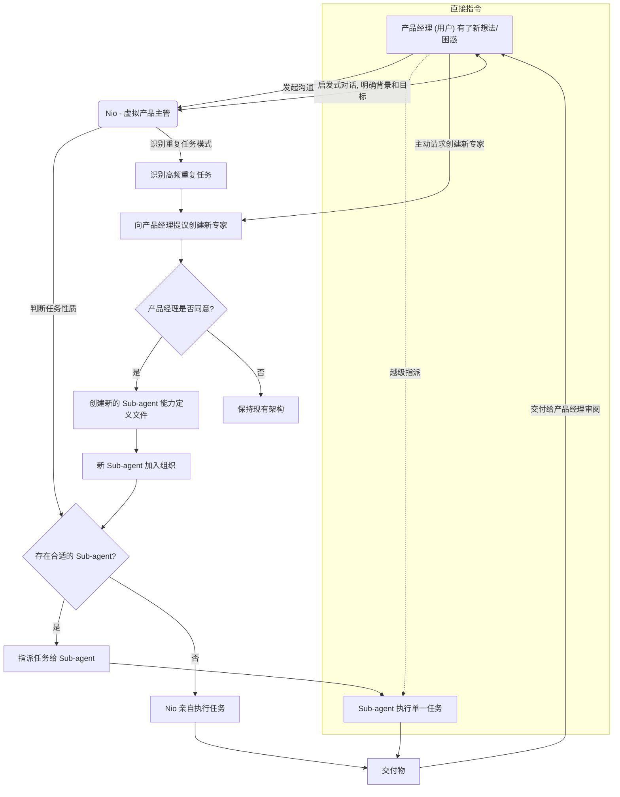

# NioPD 产品设计构想

## 第一部分：核心愿景 - AI 驱动的产品专家组织

### 1. 核心理念：AI 驱动的产品专家组织

NioPD 的核心理念是为每一位产品经理（用户）配备一个专属的、AI 驱动的产品专家组织。这个组织并非一套冰冷的工具集，而是一个具备不同角色、遵循协作规范、并能够自我进化的虚拟团队。

- **愿景**: 将产品经理从繁杂的事务性工作中解放出来，使其能专注于最高价值的战略思考、用户洞察和产品创新。NioPD 将原始的想法、混乱的反馈和复杂的数据，转化为结构清晰、可执行的产品计划。
- **目标用户**: 各阶段的产品经理，无论他们是身经百战的专家还是初入职场的新人，都可以通过 NioPD 获得能力上的巨大增幅。

#### NioPD 要解决的核心问题
1.  **想法不成体系**: 脑海中有了初步的产品构想，但缺乏系统性的框架和方法论，难以将其深化和具体化。
2.  **信息过载与合成困难**: 从用户访谈、竞品分析、数据报告等渠道涌入大量信息，手动合成这些信息费时费力，且容易遗漏关键洞察。
3.  **文档工作繁重**: 撰写和维护 PRD、路线图、周报等文档占据了大量时间。
4.  **缺少高质量的“陪练”**: 在产品设计的关键节点，缺少一个经验丰富、绝对中立的“虚拟主管”或“专家”来进行深度探讨和思维碰撞。

---

### 2. 组织架构：角色与职责

NioPD 组织由三种核心角色构成，他们共享一个工作空间、一套工具集，并遵循共同的协作规范。

#### 2.1. 产品经理 (用户)
**定位：组织的领导者和决策者。**
- **职责**:
    - **发起者**: 所有工作的起点，当产生任何 new idea 或遇到工作困惑时，主动向 Nio 发起沟通。
    - **主导者**: 掌握最终决策权，负责审阅、修订和批准所有交付物。
    - **赋能者**: 在明确任务的前提下，可以直接使用系统提供的工具，或直接指派 Sub-agent 完成特定任务，实现效率最大化。

#### 2.2. Nio (Core Agent)
**定位：虚拟产品主管，一位高维智者。**
- **职责**:
    - **激发潜能**: Nio 从不主动提供建议或直接给出答案。他的核心职责是通过苏格拉底式的提问和引导，帮助产品经理理清思路、挖掘潜能，并最终自主完成任务。
    - **任务定义与分配**: 在与产品经理的沟通中，当获取到足够完成一项任务的背景信息后，Nio 会判断任务性质，并将其清晰地定义、指派给最合适的 Sub-agent。
    - **任务执行 (例外情况)**: 只有当系统中不存在能够胜任该任务的 Sub-agent 时，Nio 才会亲自使用工具集完成任务。
    - **团队建设**: 负责“雇佣”新的 Sub-agent（见第 4 节）。

#### 2.3. Sub-agent (细分领域专家)
**定位：单一特定任务的执行者，“非请勿入”。**
- **职责**:
    - **专注执行**: 每个 Sub-agent 都是某一细分领域的专家（如：用户反馈分析、竞品分析、数据分析等），只负责高效、高质量地完成自己被指派的单一任务。
    - **无权指派**: Sub-agent 之间不能相互指派任务，保证了指令的清晰和责任的明确。

---

### 3. 协作模式：核心工作流

NioPD 的工作流遵循“用户主导，Nio 协调，专家执行”的原则。

这个工作流确保了产品经理始终处于中心位置，既能得到 Nio 的战略引导，又能利用 Sub-agent 的专业能力。

---

### 4. Agent 扩展机制：组织的自我进化

NioPD 不是一个静态的组织，它能够根据产品经理的需求而成长。
- **机制**: 当 Nio 在与产品经理的协作中，发现某一类别的任务被高频重复执行，且当前没有专门的 Sub-agent 来处理时，Nio 会主动向产品经理提议“雇佣”一位新专家。
- **过程**:
    1.  **识别模式**: Nio 识别出重复的任务模式。
    2.  **提议创建**: Nio 向产品经理提出创建新 Sub-agent 的建议，并描述该专家的职责。
    3.  **用户确认**: 产品经理同意后，Nio 会根据历史任务记录，自动总结并创建该 Sub-agent 的能力定义文件（即一个新的 `agent.md` 文件）。
    4.  **完成雇佣**: 新的 Sub-agent 加入组织，可供后续直接指派。
- **主动请求**: 产品经理也可以主动向 Nio 请求，要求创建一个符合特定能力描述的新 Sub-agent。

---

## 第二部分：底层实现 - 系统架构与功能参考

上述组织愿景由一个模块化的、基于文件的架构来支持。本节详细介绍该底层实现，内容与英文文档保持一致。

### 1. 系统架构

`NioPD` 遵循一种基于文件、由 Agent 驱动的架构，该架构强调模块化、可重用性和明确的关注点分离。所有组件都在一个结构化的目录系统中进行组织，以确保一致性和易于维护。NioPD 系统由几种关键类型的组件构成，所有组件都存储在 `.claude/` 目录中。这种结构将逻辑（提示）、动作（脚本）、规则和数据分离开来。

#### 1.1. `agents/`
- **用途:** 定义充当“上下文防火墙”的专用“sub-agent”。
- **实现:** 像 `competitor-analyzer.md` 和 `data-analyst.md` 这样的文件定义了这些 agent 的角色。其核心原则是，这些 agent 执行“重活”（如分析大型数据集或研究市场趋势），并仅向主 AI 对话返回简洁的摘要，从而保留有限的上下文窗口。
- **最佳实践:**
  - 每个 agent 都应有单一、明确定义的目标。
  - agent 的设计应能处理大量数据并产生结构化输出。
  - 上下文保留至关重要 - agent 应返回简洁的摘要。

#### 1.2. `commands/`
- **用途:** 以详细的、基于 markdown 的提示形式，包含系统的核心逻辑。
- **实现:** 此目录中的每个 `.md` 文件对应一个面向用户的命令（例如，`new-initiative.md`）。这些文件不仅仅是文档；它们是供 AI 执行的规范性程序，详细说明了预检、指令、输出格式、质量控制和错误处理。
- **结构:** 命令遵循五部分模式：
  1. **用户命令**: 用户发起的入口点（例如 `/niopd:new-initiative "My Feature"`）。
  2. **命令提示 (.md)**: 给 AI 的关于如何执行命令的详细指令。
  3. **Agent (.md) (可选)**: 用于复杂分析或合成任务的专用 agent。
  4. **模板 (.md) (可选)**: 用于生成结构一致的文档的模板。
  5. **脚本 (.sh) (可选)**: 用于执行系统级文件操作的 shell 脚本。
- **最佳实践:**
  - 命令的设计应更具对话性，技术性应较弱。
  - 每个命令都必须有清晰的预检验证步骤。
  - 必须明确定义错误处理。
  - 命令应产生一致的、结构化的输出。

#### 1.3. `scripts/`
- **用途:** 包含在用户本地系统上执行操作的 shell 脚本。它们是系统的“手”。
- **实现:** 像 `init.sh` 和 `new-initiative.sh` 这样的脚本处理诸如安装依赖、创建目录和文件操作等任务。当命令提示指示时，AI 会调用它们。
- **最佳实践:**
  - 所有脚本都应包含适当的错误处理和验证。
  - 脚本应提供清晰的成功/错误反馈。
  - 应正确设置权限 (`chmod +x`)。
  - 脚本应能在不同系统间移植。

#### 1.4. `templates/`
- **用途:** 包含系统生成的文档的可重用模板。
- **实现:** 像 `prd-template.md` 和 `initiative-template.md` 这样的模板确保所有生成的文档结构一致。
- **最佳实践:**
  - 模板应使用一致的变量格式 (`{{variable_name}}`)。
  - 应包含全面文档所需的所有必要部分。
  - 模板应足够灵活，以适应不同的用例。

#### 1.5. 数据目录 (`niopd-workspace/`)
- **用途:** 存储在产品管理工作流中生成的文件，以及用户提供的项目背景信息和原始数据。
- **实现:**
  - `niopd-workspace/initiatives/`: 包含高阶战略产品规划、头脑风暴信息和手动添加的项目背景信息。
  - `niopd-workspace/prds/`: 存储产品需求文档。
  - `niopd-workspace/reports/`: 存储生成的报告和分析，如反馈分析。
  - `niopd-workspace/roadmaps/`: 存储路线图文档。
  - `niopd-workspace/sources/`: 存储原始数据及资料，以及用户手动导入的其他数据资源文件。
- **最佳实践:**
  - 目录结构应直观且文档齐全。
  - 文件应按类型和用途组织。
  - 应使用一致的命名约定。

### 2. 功能和命令参考

以下是 `NioPD` 系统推荐的命令列表。它们的设计旨在实现对话式交互，并直接映射到产品经理的核心工作流程。

#### 2.1. 规划管理
- **`/niopd:new-initiative "Q3 Launch"`**
  - **动作:** 启动一个引导式工作流来定义一个新的高阶产品规划。
  - **询问:** 战略目标、目标指标 (KPI)、预算和相关团队。
  - **输出:** 在 `niopd-workspace/initiatives/q3-launch.md` 中创建一个新文件。

#### 2.2. 反馈与探索
- **`/niopd:import-feedback --from=intercom`**
  - **动作:** 连接到指定来源（通过 API 或文件上传）以导入原始用户反馈。
  - **Agent:** 可能使用一个辅助脚本来处理连接。
  - **输出:** 将原始数据保存在 `niopd-workspace/sources/` 中。

- **`/niopd:summarize-feedback --for="Q3 Launch"`**
  - **动作:** 使用 `feedback-synthesizer` agent 分析与特定规划相关的所有反馈。
  - **Agent:** `feedback-synthesizer`.
  - **输出:** 一个包含关键主题、用户引言和功能请求的摘要，作为报告保存在 `niopd-workspace/reports/` 中。

#### 2.3. 产品定义
- **`/niopd:draft-prd --for="Q3 Launch"`**
  - **动作:** 使用模板生成一个完整的 PRD 草稿。
  - **使用:** 规划定义和综合反馈报告。
  - **输出:** 在 `niopd-workspace/prds/` 中创建一个新文件。

- **`/niopd:edit-prd <prd-name>`**
  - **动作:** 打开指定的 PRD 进行手动编辑和完善。

#### 2.4. 路线图与沟通
- **`/niopd:update-roadmap`**
  - **动作:** 使用 `roadmap-generator` agent 创建或更新一个可视化的路线图。
  - **Agent:** `roadmap-generator`.
  - **使用:** 所有活动规划的状态和时间线。
  - **输出:** 在 `niopd-workspace/roadmaps/roadmap.md` 中创建一个文件。

- **`/niopd:generate-update --for=stakeholders`**
  - **动作:** 使用 `presentation-builder` agent 创建一个进度更新。
  - **Agent:** `presentation-builder`.
  - **询问:** 观众（例如，利益相关者、工程团队）以定制内容。
  - **输出:** 在 `niopd-workspace/reports/` 中创建一个 markdown 演示文件。

#### 2.5. 追踪与分析
- **`/niopd:track-kpis --for="Q3 Launch"`**
  - **动作:** 使用 `kpi-tracker` agent 获取一个规划的最新指标。
  - **Agent:** `kpi-tracker`.
  - **输出:** 一个包含图表和数字的状态报告。

#### 2.6. 高级功能：战略与探索
- **`/niopd:analyze-competitor --url=<url>`**: 分析竞争对手的网站。
- **`/niopd:summarize-interview --file=<path>`**: 总结用户访谈记录。
- **`/niopd:analyze-data --file=<path> --query="..."`**: 回答关于数据文件的自然语言问题。
- **`/niopd:generate-personas --from=
`**: 从反馈摘要创建用户画像。
- **`/niopd:research-trends --topic="..."`**: 研究并总结关于特定主题的市场趋势。

#### 2.7. 高级功能：规划与定义
- **`/niopd:draw-diagram --type=<type> --desc="..."`**: 从描述创建 PlantUML 或 Mermaid 图。
- **`/niopd:assess-feasibility --for=<prd>`**: 标记 PRD 中的技术复杂需求。
- **`/niopd:write-stories --for=<prd>`**: 为 PRD 编写详细的用户故事和验收标准。
- **`/niopd:identify-risks --for=<prd>`**: 识别一个规划的潜在风险。

#### 2.8. 高级功能：执行与发布
- **`/niopd:draft-release-notes --for=<prd>`**: 为一个功能生成发布说明草稿。
- **`/niopd:generate-faq --for=<prd>`**: 为一个新功能创建常见问题列表。
- **`/niopd:simplify-update --for=<initiative> --audience=...`**: 为特定观众定制利益相关者更新。
- **`/niopd:brainstorm-names --desc="..."`**: 为一个新功能进行头脑风暴命名。
