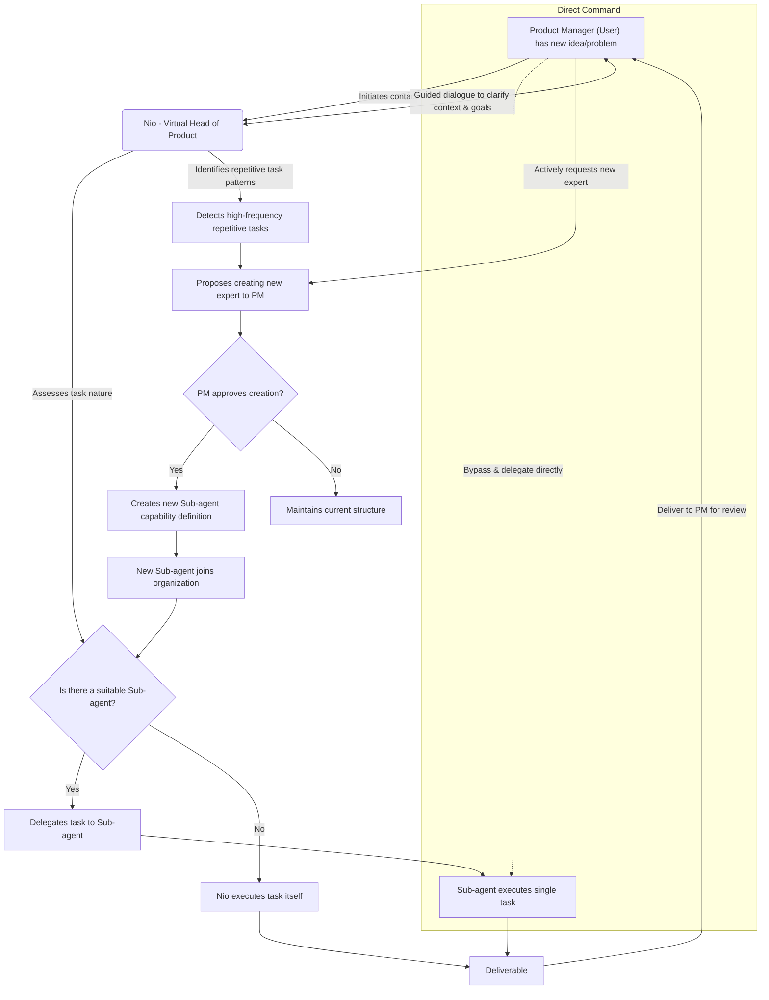

# NioPD Design Document

## Part 1: The Vision - The AI-Driven Product Expert Organization

### 1. Core Concept: An AI-Driven Product Expert Organization

The core concept of NioPD is to provide every Product Manager (User) with a dedicated, AI-driven product expert organization. This is not a cold set of tools, but a virtual team with distinct roles, collaborative protocols, and the ability to evolve.

- **Vision**: To liberate Product Managers from tedious, administrative work, allowing them to focus on high-value strategic thinking, user insight, and product innovation. NioPD transforms raw ideas, messy feedback, and complex data into structured, actionable product plans.
- **Target Audience**: Product Managers at all levels, from seasoned experts to newcomers, can achieve a significant boost in their capabilities through NioPD.

#### Core Problems NioPD Solves:
1.  **Unstructured Ideas**: Having an initial product concept but lacking a systematic framework to deepen and specify it.
2.  **Information Overload**: Being inundated with information from user interviews, competitive analysis, and data reports, making manual synthesis time-consuming and prone to missing key insights.
3.  **Documentation Burden**: Spending excessive time writing and maintaining PRDs, roadmaps, and status reports.
4.  **Lack of High-Quality Sparring**: Missing an experienced, neutral "virtual director" or "expert" for deep discussions and brainstorming at critical design junctures.

---

### 2. Organizational Structure: Roles & Responsibilities

The NioPD organization consists of three core roles who share a workspace, a toolset, and common collaboration protocols.

#### 2.1. Product Manager (The User)
**Role: The organization's leader and decision-maker.**
- **Responsibilities**:
    - **Initiator**: The starting point for all work. Initiates communication with Nio for any new idea or work-related problem.
    - **Leader**: Holds the final decision-making power, responsible for reviewing, revising, and approving all deliverables.
    - **Enabler**: Can directly use system tools or assign tasks to Sub-agents when the task is clear, maximizing efficiency.

#### 2.2. Nio (The Core Agent)
**Role: The Virtual Head of Product, a high-level guide.**
- **Responsibilities**:
    - **Potential-Unlocker**: Nio never proactively offers advice or gives direct answers. Its core duty is to help the PM clarify their thinking and unlock their potential through Socratic questioning and guidance.
    - **Task Definition & Delegation**: After gathering sufficient context from the PM, Nio defines the task clearly and delegates it to the most appropriate Sub-agent.
    - **Task Execution (Exception)**: Nio only executes a task itself if no suitable Sub-agent exists for the job.
    - **Team Building**: Responsible for "hiring" new Sub-agents (see Section 4).

#### 2.3. Sub-agents (Domain Experts)
**Role: Single-task specialists, "by invitation only."**
- **Responsibilities**:
    - **Focused Execution**: Each Sub-agent is an expert in a specific domain (e.g., user feedback analysis, competitive analysis) and is responsible for efficiently completing their single, assigned task to a high standard.
    - **No Cross-Delegation**: Sub-agents cannot delegate tasks to each other, ensuring clear lines of command and accountability.

---

### 3. Collaboration Model: The Core Workflow

The NioPD workflow follows the principle of "User-led, Nio-coordinated, Expert-executed."

This workflow ensures the Product Manager remains at the center, benefiting from both Nio's strategic guidance and the Sub-agents' specialized skills.

---

### 4. Organizational Evolution: The Agent Extension Mechanism

NioPD is not a static organization; it can grow based on the PM's needs.
- **Mechanism**: When Nio identifies a recurring task pattern that lacks a dedicated Sub-agent, it will propose "hiring" a new expert.
- **Process**:
    1.  **Pattern Recognition**: Nio identifies the repeating task.
    2.  **Creation Proposal**: Nio suggests creating a new Sub-agent and describes its role.
    3.  **User Confirmation**: Upon the PM's approval, Nio automatically creates the new Sub-agent's definition file (`agent.md`) based on historical task data.
    4.  **Hiring Complete**: The new Sub-agent joins the organization and is available for future delegation.
- **Proactive Request**: The PM can also proactively ask Nio to create a new Sub-agent with a specific skill set.

---

## Part 2: The Implementation - System Architecture & Features

The organizational vision described above is supported by a modular, file-based architecture. This section details that underlying implementation, taken verbatim from the original design document.

### 5. System Architecture

`NioPD` follows a file-based, agent-driven architecture that emphasizes modularity, reusability, and clear separation of concerns. All components are organized within a structured directory system to ensure consistency and ease of maintenance.

#### Directory Structure

The NioPD system is composed of several key types of components, all stored within the `.claude/` directory. This structure separates the logic (prompts), actions (scripts), rules, and data.

##### 1. `agents/`
- **Purpose:** Defines specialized "sub-agents" that act as context firewalls.
- **Implementation:** Files like `competitor-analyzer.md` and `data-analyst.md` define the roles of these agents. The core principle is that these agents perform "heavy lifting" (like analyzing large datasets or researching market trends) and return only a concise summary to the main AI conversation, thus preserving the limited context window.
- **Best Practices:**
  - Each agent should have a single, clearly defined purpose
  - Agents should be designed to process large amounts of data and produce structured outputs
  - Context preservation is critical - agents should return concise summaries

##### 2. `commands/`
- **Purpose:** Contains the core logic of the system in the form of detailed markdown-based prompts.
- **Implementation:** Each `.md` file in this directory corresponds to a user-facing command (e.g., `new-initiative.md`). These files are not just documentation; they are prescriptive programs for the AI to execute, detailing pre-flight checks, instructions, output formats, quality control, and error handling.
- **Structure:** Commands follow a 5-part pattern:
  1. **The User Command**: Entry point initiated by the user (e.g., `/niopd:new-initiative "My Feature"`)
  2. **The Command Prompt (.md)**: Detailed instructions for the AI on how to execute the command
  3. **The Agent (.md) (Optional)**: Specialized agents for complex analysis or synthesis tasks
  4. **The Template (.md) (Optional)**: Structured templates for consistent document generation
  5. **The Script (.sh) (Optional)**: Shell scripts for system-level file operations
- **Best Practices:**
  - Commands should be designed to be more conversational and less technical
  - Each command must have clear pre-flight validation steps
  - Error handling should be explicitly defined
  - Commands should produce consistent, structured outputs

##### 3. `scripts/`
- **Purpose:** Contains shell scripts that perform actions on the user's local system. These are the "hands" of the system.
- **Implementation:** Scripts like `init.sh` and `new-initiative.sh` handle tasks such as installing dependencies, creating directories, and file operations. They are called by the AI when instructed by a command prompt.
- **Best Practices:**
  - All scripts should include proper error handling and validation
  - Scripts should provide clear success/error feedback
  - Permissions should be properly set (`chmod +x`)
  - Scripts should be portable across different systems

##### 4. `templates/`
- **Purpose:** Contains reusable templates for documents generated by the system.
- **Implementation:** Templates like `prd-template.md` and `initiative-template.md` ensure consistent structure for all generated documents.
- **Best Practices:**
  - Templates should use consistent variable formatting (`{{variable_name}}`)
  - All necessary sections for comprehensive documentation should be included
  - Templates should be flexible enough to accommodate different use cases

##### 5. Data Directories (`niopd-workspace/`)
- **Purpose:** Stores the artifacts generated during the product management workflow, as well as user-provided project background information and raw data.
- **Implementation:**
  - `niopd-workspace/initiatives/`: Contains high-level strategic product initiatives, brainstorming information, and manually added project background information.
  - `niopd-workspace/prds/`: Stores Product Requirement Documents.
  - `niopd-workspace/reports/`: Contains generated reports and analysis, such as feedback analysis.
  - `niopd-workspace/roadmaps/`: Stores roadmap documents.
  - `niopd-workspace/sources/`: Stores raw feedback data and other data resource files manually imported by the user for analysis.
- **Best Practices:**
  - Directory structure should be intuitive and well-documented
  - Files should be organized by type and purpose
  - Consistent naming conventions should be used

### 6. Features and Command Reference

The following is a proposed list of commands for the `NioPD` system. They are designed to be conversational and map directly to a Product Manager's core workflows.

#### Initiative Management
- **`/niopd:new-initiative "Q3 Launch"`**
  - **Action:** Starts a guided workflow to define a new high-level product initiative.
  - **Asks for:** Strategic goals, target metrics (KPIs), budget, and relevant teams.
  - **Output:** Creates a new file in `niopd-workspace/initiatives/q3-launch.md`.

#### Feedback and Discovery
- **`/niopd:import-feedback --from=intercom`**
  - **Action:** Connects to a specified source (via API or file upload) to import raw user feedback.
  - **Agent:** May use a helper script to handle the connection.
  - **Output:** Saves the raw data in `niopd-workspace/sources/`.

- **`/niopd:summarize-feedback --for="Q3 Launch"`**
  - **Action:** Uses the `feedback-synthesizer` agent to analyze all feedback related to a specific initiative.
  - **Agent:** `feedback-synthesizer`.
  - **Output:** A summary of key themes, user quotes, and feature requests, saved as a report in `niopd-workspace/reports/`.

#### Product Definition
- **`/niopd:draft-prd --for="Q3 Launch"`**
  - **Action:** Generates a complete PRD draft using a template.
  - **Uses:** The initiative definition and the synthesized feedback report.
  - **Output:** A new file in `niopd-workspace/prds/`.

- **`/niopd:edit-prd <prd-name>`**
  - **Action:** Opens the specified PRD for manual editing and refinement.

#### Roadmapping and Communication
- **`/niopd:update-roadmap`**
  - **Action:** Uses the `roadmap-generator` agent to create or update a visual roadmap.
  - **Agent:** `roadmap-generator`.
  - **Uses:** The status and timelines of all active initiatives.
  - **Output:** A file in `niopd-workspace/roadmaps/roadmap.md`.

- **`/niopd:generate-update --for=stakeholders`**
  - **Action:** Uses the `presentation-builder` agent to create a progress update.
  - **Agent:** `presentation-builder`.
  - **Asks for:** Audience (e.g., stakeholders, engineering team) to tailor the content.
  - **Output:** A markdown presentation file in `niopd-workspace/reports/`.

#### Tracking and Analysis
- **`/niopd:track-kpis --for="Q3 Launch"`**
  - **Action:** Uses the `kpi-tracker` agent to fetch the latest metrics for an initiative.
  - **Agent:** `kpi-tracker`.
  - **Output:** A status report with charts and numbers.

#### Advanced: Strategy & Discovery
- **`/niopd:analyze-competitor --url=<url>`**: Analyzes a competitor's website.
- **`/niopd:summarize-interview --file=<path>`**: Summarizes a user interview transcript.
- **`/niopd:analyze-data --file=<path> --query="..."`**: Answers a natural language question about a data file.
- **`/niopd:generate-personas --from=
`**: Creates user personas from a feedback summary.
- **`/niopd:research-trends --topic="..."`**: Researches and summarizes market trends on a topic.

#### Advanced: Planning & Definition
- **`/niopd:draw-diagram --type=<type> --desc="..."`**: Creates a PlantUML or Mermaid diagram from a description.
- **`/niopd:assess-feasibility --for=<prd>`**: Flags technically complex requirements in a PRD.
- **`/niopd:write-stories --for=<prd>`**: Writes detailed user stories and acceptance criteria for a PRD.
- **`/niopd:identify-risks --for=<prd>`**: Identifies potential risks for an initiative.

#### Advanced: Execution & Launch
- **`/niopd:draft-release-notes --for=<prd>`**: Generates draft release notes for a feature.
- **`/niopd:generate-faq --for=<prd>`**: Creates a list of FAQs for a new feature.
- **`/niopd:simplify-update --for=<initiative> --audience=...`**: Tailors a stakeholder update for a specific audience.
- **`/niopd:brainstorm-names --desc="..."`**: Brainstorms names for a new feature.
