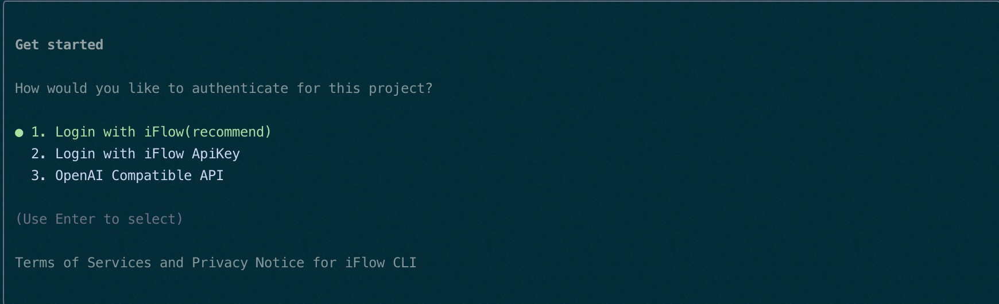
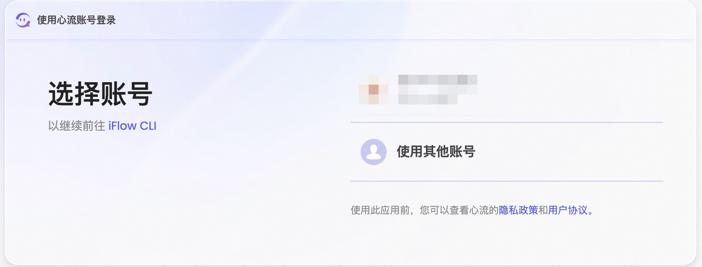
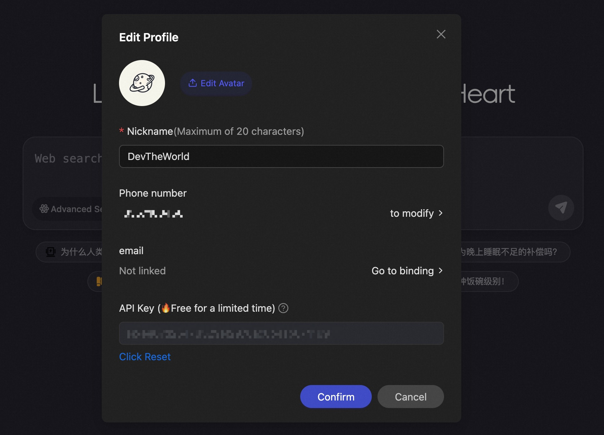

# 🤖 iFlow CLI

[](https://github.com/Piebald-AI/awesome-gemini-cli)


[English](README.md) | **中文** | [日本語](README_JA.md) | [한국어](README_KO.md) | [Français](README_FR.md) | [Deutsch](README_DE.md) | [Español](README_ES.md) | [Русский](README_RU.md)

iFlow CLI 是一款直接在终端中运行的强大 AI 助手。它能够无缝分析代码仓库、执行编程任务、理解上下文需求，通过自动化处理从简单的文件操作到复杂的工作流程，全面提升您的工作效率。

[更多使用教程](https://platform.iflow.cn/)

## ✨ 核心特性

1. **免费 AI 模型**：通过 [心流开放平台](https://platform.iflow.cn/docs/api-mode) 访问强大的免费 AI 模型，包括 Kimi K2、Qwen3 Coder、DeepSeek v3 等
2. **灵活集成**：保留你喜欢的开发工具，也可集成到现有系统实现自动化
3. **自然语言交互**：告别复杂命令，用日常对话驱动 AI，从代码开发到生活助理
4. **开放平台**：从[心流开放市场](https://platform.iflow.cn/)中可以一键安装SubAgent和MCP,快速扩展智能体，组建只属于你的AI团队


## 功能对比
| 功能 | iFlow Cli | Claude Code | Gemini Cli |
|------|-----------|---------------------|------------|
| todo规划 | ✅ | ✅ | ❌ |
| subagent | ✅ | ✅ | ❌ |
| 自定义command | ✅ | ✅ | ✅ |
| plan模式 | ✅ | ✅ | ❌ |
| task工具 | ✅ | ✅ | ❌ |
| VS Code 插件 | ✅ | ✅ | ✅ |
| JetBrain 插件 | ✅ | ✅ | ❌ |
| 对话恢复 | ✅ | ✅ | ❌ |
| 内置开放市场 | ✅ | ❌ | ❌ |
| memory自动压缩 | ✅ | ✅ | ✅ |
| 多模态能力 | ✅ | ⚠️（国内模型不支持） | ⚠️（国内模型不支持） |
| 搜索 | ✅ | ❌ | ⚠️（翻墙） |
| 免费 | ✅ | ❌ | ⚠️（次数限制） |
| Hook | ✅ | ✅ | ❌ |
| 输出样式 | ✅ | ✅ | ❌ |
| 思考 | ✅ | ✅ | ❌ |
| 工作流 | ✅ | ❌ | ❌ |
| SDK | ✅ | ✅ | ❌ |
| ACP | ✅ | ✅ | ✅ |


## ⭐ 核心功能
* 支持4种运行模式：yolo模式（模型拥有最大权限，可执行任何操作）、接受编辑模式（模型仅拥有文件修改权限）、计划模式（先计划后执行）、默认模式（模型无权限）
* 升级subAgent功能：将CLI从通用助手转变为专家团队，提供更专业准确的建议。使用 /agent 查看更多预配置代理
* 升级task工具：有效压缩上下文长度，让CLI更彻底地完成您的任务。当上下文达到70%时自动压缩
* 集成心流开放市场：快速安装有用的MCP工具、Subagents、自定义指令和工作流
* 免费多模态模型使用：现在您也可以在CLI中粘贴图片了（Ctrl+V粘贴图片）
* 支持对话历史保存和回滚（iflow --resume 和 /chat 命令）
* 支持更多有用的终端命令（iflow -h 查看更多命令）
* VSCode插件支持
* 自动升级：iFlow CLI自动检测当前版本是否为最新版本

## 📥 安装

### 系统要求
- 操作系统：macOS 10.15+、Ubuntu 20.04+/Debian 10+，或 Windows 10+（使用 WSL 1、WSL 2 或 Git for Windows）
- 硬件：4GB+ 内存
- 软件：Node.js 22+
- 网络：需要互联网连接用于身份验证和 AI 处理
- Shell：在 Bash、Zsh 或 Fish 中效果最佳

### 安装命令
**MAC/Linux/Ubuntu用户**：
* 一键安装命令(推荐)
```shell
bash -c "$(curl -fsSL https://cloud.iflow.cn/iflow-cli/install.sh)"
```
* 使用Node.js安装
```shell
npm i -g @iflow-ai/iflow-cli
```

此命令会自动为您的终端安装所有必要的依赖项。

**Windows 用户**：
1. 访问 https://nodejs.org/zh-cn/download 下载最新的 Node.js 安装程序
2. 运行安装程序来安装 Node.js
3. 重启终端：CMD 或 PowerShell
4. 运行 `npm install -g @iflow-ai/iflow-cli` 来安装 iFlow CLI
5. 运行 `iflow` 来启动 iFlow CLI

如果您在中国大陆，可以使用以下命令安装 iFlow CLI：
1. 访问 https://cloud.iflow.cn/iflow-cli/nvm-setup.exe 下载最新的 nvm 安装程序
2. 运行安装程序来安装 nvm
3. **重启终端：CMD 或 PowerShell**
4. 运行 `nvm node_mirror https://npmmirror.com/mirrors/node/` 和 `nvm npm_mirror https://npmmirror.com/mirrors/npm/`
5. 运行 `nvm install 22` 来安装 Node.js 22，稍等片刻
6. 运行 `nvm use 22` 来使用 Node.js 22
7. 运行 `npm install -g @iflow-ai/iflow-cli` 来安装 iFlow CLI
8. 运行 `iflow` 来启动 iFlow CLI

## 🗑️ 卸载
```shell
npm uninstall -g @iflow-ai/iflow-cli
```

## 🔑 身份验证

iFlow Cli提供两种身份验证方式：

1. **推荐方式**：使用 iFlow 原生身份验证
2. **备选方式**：通过 OpenAI 兼容 API 连接



直接选择方式一登录，会在网页唤起iFlow账户认证，完成认证后即可免费使用



如果您在例如服务器这种无法唤起网页的环境使用，请使用方式二登录

获取 API Key的步骤：
1. 注册 iFlow 账户
2. 进入个人设置页面或点击[此直达链接](https://iflow.cn/?open=setting)
3. 在弹出对话框中点击"重置"生成新的 API 密钥



生成密钥后，将其粘贴到终端提示符中即可完成设置。**注意**：在 Windows 的 CMD 或者 PowerShell 中，请点击右键进行粘贴。

## 🚀 快速开始

要启动 iFlow CLI，请在终端中导航到您的工作空间并输入：

```shell
iflow
```

### 创建新项目

对于新项目，只需描述您想要创建的内容：

```shell
cd new-project/
iflow
> 使用 HTML 创建一个基于网页的我的世界游戏
```

### 处理现有项目

对于现有代码库，建议先使用 `/init` 命令帮助 iFlow 理解您的项目：

```shell
cd project1/
iflow
> /init
> 根据 requirement.md 文件中的 PRD 文档分析需求，输出技术文档，然后实现解决方案。
```

`/init` 命令会扫描您的代码库，学习其结构，并创建包含完整文档的 IFLOW.md 文件。

有关斜杠命令的完整列表和使用说明，请查看[这里](./i18/cn/commands.md)。

## 💡 常见使用场景

iFlow CLI 的功能远不止编程，它能处理各种类型的任务：

### 📊 信息查询与规划

```text
> 帮我找到北京评分最高的餐厅，制定一个3天的美食之旅行程。
```

```text
> 搜索最新的 iPhone 价格对比，找到最具性价比的购买方案。
```

### 📁 文件管理

```text
> 将我桌面上的文件按文件类型整理到不同的文件夹中。
```

```text
> 批量下载这个网页上的所有图片，并按日期重命名。
```

### 📈 数据分析

```text
> 分析这个 Excel 表格中的销售数据，生成简单的图表。
```

```text
> 从这些 CSV 文件中提取客户信息，合并成统一的表格。
```

### 👨‍💻 开发支持

```text
> 分析这个系统的主要架构组件和模块依赖关系。
```

```text
> 我的请求后出现了空指针异常，请帮我找到问题原因。
```

### ⚙️ 工作流自动化

```text
> 创建一个脚本，定期将我的重要文件备份到云存储。
```

```text
> 编写一个程序，每天下载股票价格并发送邮件通知。
```

*注意：高级自动化任务可以利用 MCP 服务器将您的本地系统工具与企业协作套件集成。*

## 🔧 切换自定义模型

iFlow CLI 可以连接任何兼容 OpenAI 的 API。编辑 `~/.iflow/settings.json` 中的设置文件来更改您使用的模型。

以下是设置文件示例：
```json
{
    "theme": "Default",
    "selectedAuthType": "iflow",
    "apiKey": "your iflow key",
    "baseUrl": "https://apis.iflow.cn/v1",
    "modelName": "Qwen3-Coder",
    "searchApiKey": "your iflow key"
}
```

## 🔄 GitHub Actions

您也可以在 GitHub Actions 工作流中使用社区维护的 action：[iflow-cli-action](https://github.com/vibe-ideas/iflow-cli-action)

## 👥 社区交流
如果您在使用过程中遇到问题，可以直接在 GitHub 页面上提出 Issues。

您也可以扫描以下微信群二维码加入社区群进行交流讨论。

### 微信群

