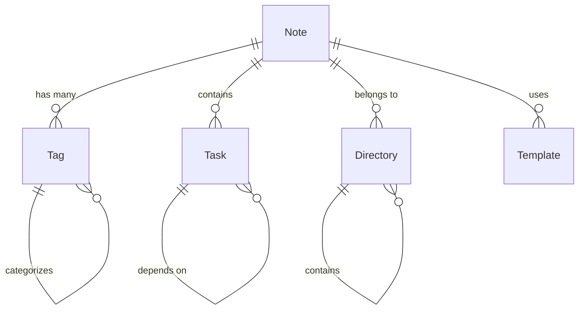

# Feature Specification: Obsidian iFlow Workflow Automation

**Feature Branch**: `001-obsidian-iflow-workflow`  
**Created**: 2025-10-19  
**Status**: Draft  
**Input**: User description: "我们需要构建一个应用到obsidian的iflow workflow， 帮助obsidian用户干一些烦人耗时的手动动作。提供一个参考列表，但是不限于次： (1) 自动标签系统：基于内容分析自动为文件添加标签，包括关键词提取自动打标、文件类型识别标签、时间周期自动标签、项目关联自动标签和情绪分析标签。 (2) 智能目录管理：Agent生成和维护多级目录，包括自动识别标题层级生成目录、目录随内容更新自动同步、支持自定义目录样式和目录深度智能调节。 (3) 收集目录管理：统一管理Web Clipper收集内容，包括预设收集目录结构、自动分类归档规则、收集内容元数据提取和去重合并机制。 (4) 周期模板系统：自动生成日周月计划总结模板，包括模板变量自动填充、周期任务自动继承、进度数据自动汇总和模板个性化定制。 (5) 任务优先级管理：智能排序和展示任务列表，包括多维度优先级计算、依赖关系识别、截止时间提醒和任务进度可视化。 (6) 智能工作安排：基于对话和内容安排日程，包括自然语言任务解析、时间块自动分配、上下文感知调度和冲突检测解决。 (7) 个人理财跟踪：财务数据记录和分析，包括收支自动分类、预算执行监控、投资组合跟踪和财务报告生成。 (8) 生活优化工具：提升个人效率和生活质量，包括习惯追踪养成、健康数据集成、学习进度管理和社交关系维护。 (9) 扩展需求包括：知识关联发现、内容自动摘要、写作辅助增强、数据备份同步、性能优化和移动端适配。"

## User Scenarios & Testing *(mandatory)*

### User Story 1 - 自动标签管理 (Priority: P1)

作为Obsidian用户，我希望笔记能够自动添加相关标签，这样我可以更轻松地组织和搜索内容，而无需手动标记每个文件。

**Why this priority**: 自动标签是知识管理的基础，直接影响内容发现和检索效率，是其他高级功能的基础依赖。

**Independent Test**: 可以完全通过上传新笔记文件并验证自动标签是否正确应用来测试，提供立即可见的组织价值。

**Acceptance Scenarios**:

1. **Given** 用户创建一个新的笔记文件，**When** 文件保存时，**Then** 系统基于内容关键词自动添加相关标签
2. **Given** 用户编辑现有笔记，**When** 内容发生重大变化时，**Then** 系统自动更新标签以反映新内容
3. **Given** 用户查看标签列表，**When** 系统显示自动生成的标签，**Then** 用户可以手动调整或删除不准确的标签

---

### User Story 2 - 智能目录管理 (Priority: P2)

作为Obsidian用户，我希望笔记库能够自动维护清晰的目录结构，这样我可以快速浏览和导航笔记，而无需手动组织文件结构。

**Why this priority**: 目录结构是用户日常导航的核心体验，直接影响工作流效率。

**Independent Test**: 可以通过验证系统是否正确识别标题层级并生成相应目录来独立测试。

**Acceptance Scenarios**:

1. **Given** 用户创建包含多级标题的笔记，**When** 系统分析文档结构，**Then** 自动生成对应的多级目录
2. **Given** 用户修改笔记标题，**When** 目录结构需要更新，**Then** 系统自动同步目录与内容
3. **Given** 用户选择不同的目录样式，**When** 应用自定义设置，**Then** 目录显示效果相应变化

---

### User Story 3 - 任务优先级管理 (Priority: P3)

作为Obsidian用户，我希望任务能够自动排序和提醒，这样我可以专注于最重要的工作，而无需手动管理任务优先级。

**Why this priority**: 任务管理是个人生产力的核心功能，优先级排序直接影响工作效率。

**Independent Test**: 可以通过创建多个任务并验证系统是否正确计算优先级和显示提醒来独立测试。

**Acceptance Scenarios**:

1. **Given** 用户创建多个任务，**When** 系统分析截止时间和依赖关系，**Then** 自动计算并显示优先级排序
2. **Given** 任务接近截止时间，**When** 用户查看任务列表，**Then** 系统突出显示即将到期的任务
3. **Given** 用户完成依赖任务，**When** 系统检测到依赖关系变化，**Then** 自动更新相关任务的可用状态

---

### Edge Cases & Error Handling *(mandatory)*

#### 1. 标签不准确处理 (Tag Accuracy Issues)

**检测条件**:
- 标签置信度 < 0.7
- 用户连续3次拒绝同一类型标签
- 标签冲突（同一内容被标记为对立标签）

**处理流程**:
1. **低置信度标签**:
   - 系统标记为"建议标签"（灰色显示）
   - 用户可以选择接受、修改或拒绝
   - 被拒绝的标签记录到用户偏好中学习

2. **用户反馈学习**:
   - 记录用户的接受/拒绝行为
   - 调整标签算法的权重参数
   - 7天后重新评估被拒绝的标签

3. **回退机制**:
   - 提供"智能标签"开关（用户可关闭）
   - 回退到基于文件名的简单标签
   - 提供手动标签建议列表

#### 2. 复杂目录结构性能优化 (Complex TOC Performance)

**检测条件**:
- 目录层级 > 6级
- 单文件标题数量 > 50个
- 嵌套列表深度 > 4级

**处理策略**:
1. **分层加载**:
   - 初始显示前3级目录
   - 提供"展开更多"按钮
   - 异步加载深层目录

2. **智能截断**:
   - 超过阈值的目录自动折叠
   - 提供"显示全部"选项
   - 记忆用户的展开偏好

3. **性能优化**:
   - 使用虚拟滚动技术
   - 缓存已解析的目录结构
   - 增量更新而非全量重算

#### 3. 任务依赖循环检测 (Task Dependency Cycles)

**检测算法**:
```python
def detect_cycle(tasks):
    graph = build_dependency_graph(tasks)
    visited = set()
    rec_stack = set()
    
    for task in tasks:
        if task not in visited:
            if has_cycle_util(task, visited, rec_stack, graph):
                return True, find_cycle_path(task, graph)
    return False, []
```

**处理流程**:
1. **循环检测**:
   - 每次任务依赖更新时检测
   - 使用深度优先搜索(DFS)算法
   - 记录循环路径供用户查看

2. **冲突解决**:
   - 标记循环中的任务为"冲突状态"
   - 提供可视化循环图
   - 建议用户移除或修改依赖关系

3. **自动修复建议**:
   - 识别可以安全移除的依赖
   - 建议依赖关系的替代方案
   - 提供一键修复选项（用户确认后）

#### 4. 大数据量性能处理 (Large Dataset Performance)

**检测阈值**:
- Vault文件数量 > 5,000个
- 总数据量 > 500MB
- 单文件大小 > 10MB

**优化策略**:

1. **增量处理**:
   - 只处理修改时间 > 最后处理时间的文件
   - 使用文件系统监视器实时跟踪变化
   - 建立文件变更索引

2. **分批处理**:
   ```python
   BATCH_SIZE = 100
   for batch in chunk_list(files, BATCH_SIZE):
       process_batch(batch)
       time.sleep(0.1)  # 避免CPU过载
   ```

3. **内存管理**:
   - 使用生成器而非列表加载大文件
   - 实现文件内容的流式处理
   - 定期清理处理缓存

4. **索引优化**:
   - 为常用查询字段建立索引
   - 使用全文搜索而非线性扫描
   - 实现分片处理（按目录或时间）

#### 5. 离线功能支持 (Offline Functionality)

**检测条件**:
- API连接超时 > 30秒
- 网络不可达错误
- DNS解析失败

**离线模式功能**:

1. **本地缓存**:
   - 缓存最近的API响应（默认缓存1小时）
   - 本地存储用户操作队列
   - 维护本地文件索引

2. **操作队列**:
   ```python
   class OfflineQueue:
       def add_operation(self, operation, data):
           # 存储操作到本地数据库
           pass
       
       def sync_when_online(self):
           # 网络恢复后批量同步
           pass
   ```

3. **降级服务**:
   - 标签功能：使用本地算法（准确度可能降低）
   - 目录功能：基于正则表达式解析
   - 任务功能：使用简单的优先级规则

4. **同步策略**:
   - 网络恢复后自动同步队列
   - 检测并解决冲突（最后修改时间优先）
   - 通知用户同步结果

#### 6. 通用错误处理框架

**错误分类**:
- **用户错误** (4xx): 参数错误、权限问题
- **系统错误** (5xx): 服务不可用、内部错误
- **网络错误**: 连接超时、DNS失败
- **数据错误**: 格式错误、验证失败

**处理原则**:
1. **用户友好**: 技术错误转换为易懂的消息
2. **可操作**: 每个错误都提供解决建议
3. **可恢复**: 尽可能提供自动恢复选项
4. **可追踪**: 详细记录错误上下文信息

**错误响应格式**:
```json
{
  "error": {
    "code": "TAGGING_FAILED",
    "message": "无法为文件生成标签",
    "details": "网络连接超时，已切换到离线模式",
    "suggestion": "请检查网络连接或稍后重试",
    "retryable": true,
    "timestamp": "2025-10-20T10:30:00Z"
  }
}
```

## Requirements *(mandatory)*

### Functional Requirements

- **FR-001**: 系统必须基于内容关键词自动为笔记文件添加标签
- **FR-002**: 系统必须识别文件类型并应用相应的分类标签  
- **FR-003**: 系统必须根据时间周期自动添加时间相关的标签
- **FR-004**: 系统必须分析项目上下文并添加项目关联标签
- **FR-005**: 系统必须分析文本情绪并添加情绪标签
- **FR-006**: 系统必须自动识别笔记标题层级并生成多级目录
- **FR-007**: 系统必须在笔记内容更新时自动同步目录结构
- **FR-008**: 系统必须支持用户自定义目录显示样式
- **FR-009**: 系统必须根据内容复杂度智能调节目录深度
- **FR-010**: 系统必须基于多维度因素计算任务优先级（截止时间、依赖关系、重要性）
- **FR-011**: 系统必须识别任务间的依赖关系
- **FR-012**: 系统必须在任务接近截止时间时提供提醒
- **FR-013**: 系统必须可视化展示任务进度状态
- **FR-014**: 系统必须支持预设的收集目录结构
- **FR-015**: 系统必须自动分类和归档收集的内容
- **FR-016**: 系统必须提取收集内容的元数据
- **FR-017**: 系统必须检测并处理重复内容
- **FR-018**: 系统必须自动生成日周月计划总结模板
- **FR-019**: 系统必须自动填充模板变量
- **FR-020**: 系统必须支持周期任务的自动继承

### Key Entities

- **Note**: 代表用户笔记，包含内容、元数据、标签和目录位置
- **Tag**: 标签实体，包含名称、类型（自动/手动）、置信度
- **Directory**: 目录结构，包含层级关系、显示样式、深度设置
- **Task**: 任务实体，包含优先级、截止时间、依赖关系、进度状态
- **Template**: 模板实体，包含变量、周期设置、个性化配置

## Success Criteria *(mandatory)*

### Measurable Outcomes

- **SC-001**: 用户笔记自动标签准确率达到85%以上
- **SC-002**: 目录生成准确率达到90%，正确反映笔记层级结构
- **SC-003**: 任务优先级排序准确率超过80%，用户手动调整次数减少70%
- **SC-004**: 系统响应时间在用户操作后3秒内完成自动处理
- **SC-005**: 用户完成常见笔记组织任务的时间减少50%
- **SC-006**: 90%的用户能够在不看文档的情况下正确使用核心功能
- **SC-007**: 重复内容检测准确率达到95%

## Non-Functional Requirements *(mandatory)*

### Performance Requirements
- **PERF-001**: 系统必须在3秒内完成单文件标签分析（≤1000字符）
- **PERF-002**: 批量处理10个文件时，总处理时间不得超过30秒
- **PERF-003**: 内存使用量不得超过500MB（单vault，≤1000个笔记文件）
- **PERF-004**: CPU使用率不得超过70%（持续5分钟以上）
- **PERF-005**: 目录生成必须在1秒内完成（单文件，≤5级标题）

### Security & Privacy Requirements
- **SEC-001**: 所有API通信必须使用HTTPS（如果启用远程访问）
- **SEC-002**: Bearer Token必须存储在加密的环境变量中，不得硬编码
- **SEC-003**: 系统不得将笔记内容传输到外部服务（本地处理）
- **SEC-004**: 必须支持vault级别的访问权限控制
- **SEC-005**: 敏感配置信息必须在日志中脱敏处理

### Reliability & Availability Requirements
- **REL-001**: 系统可用性必须达到99.5%（每日运行时间）
- **REL-002**: 处理失败时必须提供明确的错误信息和恢复建议
- **REL-003**: 必须实现自动重试机制（最大3次重试，指数退避）
- **REL-004**: 必须支持断点续传和增量处理
- **REL-005**: 系统崩溃后必须在30秒内自动恢复

### Observability Requirements
- **OBS-001**: 必须记录所有关键操作的执行时间和结果
- **OBS-002**: 必须提供性能指标监控（处理时间、成功率、错误率）
- **OBS-003**: 必须支持日志级别配置（ERROR、WARN、INFO、DEBUG）
- **OBS-004**: 必须实现健康检查端点（供外部监控使用）
- **OBS-005**: 关键错误必须发送告警通知（可配置）

## Clarifications

### Session 2025-10-20

- Q: 非功能性要求 - 性能和安全约束 → A: 添加完整的性能、安全、可靠性基准要求，包括具体的性能指标、安全要求和可观测性要求
- Q: Obsidian Local REST API集成细节 → A: 添加完整的API集成规范，包括端点、错误码、重试策略、认证方式和内容格式支持
- Q: 数据模型和实体关系 → A: 添加完整的ER图、关系定义、状态转换规则、数据规模假设和去重规则
- Q: 边缘情况处理方案 → A: 为每个边缘情况添加详细的处理流程和回退机制，包括标签不准确、复杂目录性能、任务依赖循环、大数据量处理和离线功能支持

## Data Model & Entity Relationships *(mandatory)*

### Entity Relationship Diagram



### Entity Definitions

#### Note Entity
```yaml
Note:
  id: string (UUID, primary key)
  filename: string (unique, not null)
  title: string (not null)
  content: text (markdown)
  created_at: datetime (not null)
  updated_at: datetime (not null)
  file_size: integer (bytes)
  word_count: integer
  directory_id: string (FK to Directory)
  template_id: string (FK to Template, nullable)
  status: enum(draft, published, archived)
  version: integer (default: 1)
```

#### Tag Entity
```yaml
Tag:
  id: string (UUID, primary key)
  name: string (unique, not null, max: 50 chars)
  type: enum(keyword, file_type, time_period, project, sentiment, custom)
  confidence: float (0.0-1.0, default: 0.8)
  source: enum(auto, manual, system)
  created_at: datetime (not null)
  updated_at: datetime (not null)
  color: string (hex color, nullable)
  description: string (max: 200 chars, nullable)
```

#### Task Entity
```yaml
Task:
  id: string (UUID, primary key)
  title: string (not null, max: 200 chars)
  description: text (nullable)
  priority: integer (1-5, default: 3)
  status: enum(todo, in_progress, done, cancelled)
  due_date: datetime (nullable)
  estimated_hours: float (nullable)
  actual_hours: float (nullable)
  note_id: string (FK to Note)
  parent_task_id: string (FK to Task, nullable)
  created_at: datetime (not null)
  updated_at: datetime (not null)
  completed_at: datetime (nullable)
```

#### Directory Entity
```yaml
Directory:
  id: string (UUID, primary key)
  name: string (not null, max: 100 chars)
  path: string (unique, not null)
  parent_id: string (FK to Directory, nullable)
  level: integer (1-10, default: 1)
  style: enum(numeric, bullet, mixed)
  max_depth: integer (2-6, default: 4)
  is_auto_generated: boolean (default: true)
  created_at: datetime (not null)
  updated_at: datetime (not null)
```

#### Template Entity
```yaml
Template:
  id: string (UUID, primary key)
  name: string (unique, not null, max: 50 chars)
  type: enum(daily, weekly, monthly, meeting, project, custom)
  content: text (markdown template)
  variables: json (template variables schema)
  period: enum(daily, weekly, monthly, quarterly, yearly)
  is_active: boolean (default: true)
  created_at: datetime (not null)
  updated_at: datetime (not null)
```

#### Note-Tag Relationship (Many-to-Many)
```yaml
NoteTag:
  note_id: string (FK to Note, part of composite PK)
  tag_id: string (FK to Tag, part of composite PK)
  confidence: float (0.0-1.0, default: 0.8)
  source: enum(auto, manual, system)
  created_at: datetime (not null)
  updated_at: datetime (not null)
```

### State Transition Rules

#### Note Status Transitions
```
draft → published → archived
   ↓        ↓
cancelled  cancelled
```
- **draft → published**: 内容完成并准备好使用
- **published → archived**: 内容过时或不再活跃
- **any → cancelled**: 内容被废弃

#### Task Status Transitions
```
todo → in_progress → done
  ↓        ↓
cancelled  cancelled
```
- **todo → in_progress**: 开始执行任务
- **in_progress → done**: 任务完成
- **any → cancelled**: 任务被取消

#### Tag Confidence Levels
- **0.9-1.0**: 高置信度（系统推荐，用户可直接接受）
- **0.7-0.89**: 中等置信度（系统推荐，用户需确认）
- **0.5-0.69**: 低置信度（系统建议，用户需审核）
- **<0.5**: 极低置信度（不自动应用，仅建议）

### Data Volume & Scale Assumptions

#### Scale Projections
- **单个Vault规模**: 100-10,000个笔记文件
- **单个文件大小**: 1KB-1MB（平均50KB）
- **标签密度**: 每篇笔记2-15个标签（平均5个）
- **任务密度**: 每篇笔记0-10个任务（平均2个）
- **目录深度**: 2-6级（平均4级）

#### Performance Targets
- **数据库查询**: 单表查询<100ms，关联查询<500ms
- **文件扫描**: 1000个文件<30秒，增量扫描<5秒
- **内存使用**: 基础内存<200MB，处理时峰值<500MB
- **存储增长**: 每月增长<10%（含索引和缓存）

### Uniqueness & Deduplication Rules

#### Content Deduplication
- **文件级去重**: 基于文件路径和内容的MD5哈希
- **内容相似度**: 使用文本相似度算法（>85%相似视为重复）
- **标签去重**: 同义词检测和标准化（大小写、单复数）
- **任务去重**: 基于标题相似度和时间窗口（7天内）

#### Identity Resolution
- **文件识别**: 路径+文件名作为唯一标识
- **标签识别**: 名称标准化后的小写形式
- **任务识别**: 在所属笔记内的唯一标题
- **目录识别**: 完整路径作为唯一标识

## Integration Requirements *(mandatory)*

### Obsidian Local REST API Integration

#### API Version Requirements
- **API-001**: 必须支持 Local REST API v1.0 及以上版本
- **API-002**: 必须兼容 Obsidian v0.15.0 及以上版本
- **API-003**: 必须支持 Bearer Token 认证方式

#### Core API Endpoints

**Vault文件操作**:
- `GET /vault/` - 列出vault根目录文件
- `GET /vault/{filename}` - 获取指定文件内容（支持application/vnd.olrapi.note+json格式）
- `PUT /vault/{filename}` - 创建或更新文件
- `POST /vault/{filename}` - 追加内容到文件末尾
- `PATCH /vault/{filename}` - 相对定位插入内容（支持heading、block、frontmatter）
- `DELETE /vault/{filename}` - 删除指定文件

**活动文件操作**:
- `GET /active/` - 获取当前活动文件内容
- `PUT /active/` - 更新活动文件内容
- `POST /active/` - 追加内容到活动文件
- `PATCH /active/` - 相对定位修改活动文件内容

**搜索功能**:
- `POST /search/simple?query={query}` - 简单文本搜索
- `POST /search/` - 高级搜索（支持Dataview DQL和JsonLogic查询）

#### 认证和安全
- **AUTH-001**: 所有API请求（除GET /外）必须包含Bearer Token认证头
- **AUTH-002**: Token格式: `Authorization: Bearer {OBSIDIAN_BEARER_TOKEN}`
- **AUTH-003**: 认证失败时必须返回401状态码并提供清晰的错误信息
- **AUTH-004**: 必须支持API密钥轮换而不中断服务

#### 错误处理策略
- **ERROR-001**: 404错误: 文件不存在时返回，必须提供友好的用户提示
- **ERROR-002**: 405错误: 路径引用目录而非文件时返回
- **ERROR-003**: 400错误: 请求格式错误时返回，必须包含具体的错误详情
- **ERROR-004**: 429错误: 速率限制触发时返回，必须包含重试等待时间
- **ERROR-005**: 500错误: 服务器内部错误时返回，必须记录详细日志供调试

#### 重试和回退机制
- **RETRY-001**: 网络超时（>5秒）时必须自动重试，最多3次
- **RETRY-002**: 5xx错误必须采用指数退避策略重试（1s, 2s, 4s）
- **RETRY-003**: 429错误必须等待指定的重试时间后重试
- **RETRY-004**: 重试失败时必须提供本地文件操作的回退方案
- **RETRY-005**: 必须记录所有重试操作供故障排查

#### 内容格式支持
- **FORMAT-001**: 必须支持 `text/markdown` 纯Markdown内容
- **FORMAT-002**: 必须支持 `application/vnd.olrapi.note+json` 完整笔记对象格式
- **FORMAT-003**: 必须正确处理YAML frontmatter元数据
- **FORMAT-004**: 必须支持Obsidian内部链接语法 `[[链接]]`
- **FORMAT-005**: 必须支持标签解析和提取

#### 性能优化
- **PERF-API-001**: API请求必须实现连接池复用
- **PERF-API-002**: 批量操作必须合并为单个API请求（如果支持）
- **PERF-API-003**: 必须实现响应缓存机制（可配置超时）
- **PERF-API-004**: 大文件处理必须支持分块传输
- **PERF-API-005**: 必须监控API响应时间并记录性能指标

## Assumptions

- 用户已经安装并配置好Obsidian笔记应用
- 系统运行在用户的本地设备上，处理用户本地笔记库
- 用户同意系统分析笔记内容以实现自动化功能
- 系统支持中文内容处理和分析
- 默认标签和目录样式能够满足大多数用户需求
- 用户具备基本的Obsidian使用经验